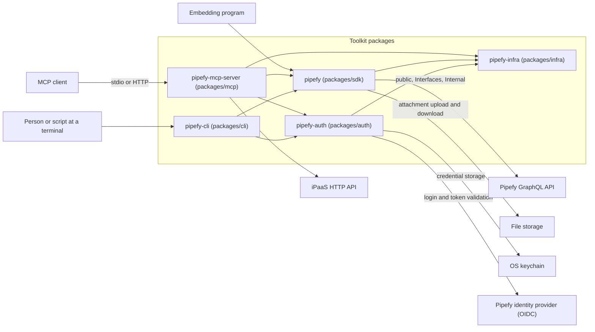

# Architecture

The toolkit gives a programmer, a script, and an LLM access to their Pipefy organizations. It ships one application for each: the SDK, the CLI, and the MCP server. This document is the map of the architecture that serves all three, down to the layers inside one package.

These readers arrive here:

- A contributor who changes code starts at [Package decomposition](#package-decomposition) and reads inward from there.
- A reviewer wants the rule and the ID to cite, and both live in [`conventions.md`](conventions.md).
- A consumer of one application wants its interface instead of the layer model, in [`docs/mcp`](../mcp/README.md), [`docs/cli`](../cli/README.md), or [`docs/sdk`](../sdk/README.md).

The map explains rather than instructs. It points at the owner of a fact rather than repeat it: a check, a schema, or a record under [`adr/`](adr/README.md). A copy appears only where the argument here depends on it. The reader pays one hop for that, and [`authoring.md`](authoring.md) states the rule for the whole tree. Where the code does not match the map, [Known gaps](#known-gaps) names the difference.

## Quality requirements

Each row states a demand that a consumer of an application holds, in that consumer's terms. A category alone is not a requirement, so every row carries its demand beside it. This section holds every requirement that shaped a decision here. A quality that shaped no decision has no row.

One question decides the table for a new row. Can a release break this demand? A release never breaks a guarantee, so a guarantee carries no rank. A release can break a goal, so a goal carries one. The goal with rank 1 breaks last.

Each section names the requirement that it serves. If no section serves it, [Known gaps](#known-gaps) names it.

**Guarantees.** Each one is a demand that every release keeps.

| ID | Category | Demand | Held by |
|---|---|---|---|
| `QR-3` | Operability | When no human is present, a run never blocks on an answer | The CLI consumer in a pipeline, and the headless MCP consumer |
| `QR-4` | Security | A request acts as the caller that sent it, and never as another caller | The MCP consumer under the remote profile |
| `QR-6` | Safety | A destructive operation names what it affects before it runs | The MCP consumer and the CLI consumer |
| `QR-7` | Correctness | An ambiguous identifier never silently resolves to one match | Every consumer |
| `QR-11` | Compatibility | An announcement precedes every breaking change | The SDK consumer, and any script or agent that names a command or a tool |
| `QR-12` | Diagnosability | A partial result names what did not succeed | Every consumer |

**Goals.** The rank states what a consumer can do when a goal breaks.

| Rank | ID | Category | Demand | Held by |
|---|---|---|---|---|
| 1 | `QR-8` | Diagnosability | A failure names its cause and whether a retry can succeed | Every consumer |
| 2 | `QR-1` | Usability | An invalid request names the field and the rule it broke | Every consumer |
| 3 | `QR-2` | Compatibility | A vendor API change does not reach the consumer's code | The SDK consumer, and any script that parses output |
| 4 | `QR-9` | Efficiency | The tool list carries only what the consumer's work needs | The MCP consumer |
| 5 | `QR-5` | Efficiency | One user intent costs one call | The MCP consumer |
| 6 | `QR-10` | Efficiency | A response carries only what the intent needs | The MCP consumer |

`QR-8` and `QR-1` rank first. A consumer who cannot see why a call failed cannot act at all. `QR-2` follows, because that consumer can act, but pays for a change they did not make. The last three are costs that a consumer can measure and plan for.

The three Efficiency rows are three separate costs, and each one lands at a different moment. The catalog costs once at connect, the calls cost once per intent, and the payload costs once per call. `QR-9` outranks the other two, because its cost lands before the consumer asks for anything.

These trades are real:

- A confirmation that the model must answer costs a second call, so `QR-6` spends what `QR-5` saves. A confirmation that the client answers costs `QR-5` nothing.
- When no human is present, a consent dialog cannot run, so `QR-3` leaves the intent to an explicit flag.
- The `power` branch holds the tool count constant, and every call then routes through a meta-tool, so `QR-9` spends what `QR-5` saves.

## Constraints

Limits that this repository does not decide.

- The MCP protocol publishes a tool's inputs as JSON Schema, and a language model fills them from that schema alone. The schema is therefore an instruction to the model, and not only a check on what arrives.
- The Pipefy GraphQL API is not ours to change, so its entity shape and its error shape come as the vendor defines them. Any better shape is a translation that we build and maintain.
- The OS keychain is not available in every environment, so credential storage carries a file backend for a headless one.

## Context and scope

In domain terms, the toolkit acts on the Pipefy organizations that a caller can access. Every call acts as a member or a service account of one of them. Inside an organization, a pipe holds the definition of a process and a card is one run of that process. A table holds records of the business entities that a process reads, and a record has no lifecycle of its own. Around those, the toolkit reaches portals, reports, members and roles, webhooks, files in storage, and the automations of a pipe. It also reaches the flows of the iPaaS, which run on a separate engine, and [`docs/ipaas.md`](../ipaas.md) defines those terms. The GraphQL schema owns the entity shape.

The diagram draws the boundary in both directions, with the toolkit packages inside it.

The legend:

- An arrow between two packages is a dependency that the package declares in its own `pyproject.toml`.
- An arrow that crosses the boundary names the concept, and not the class that implements it. The port names are in [Ports and dependency inversion](#ports-and-dependency-inversion).
- The `transport` setting decides whether an MCP client arrives over stdio or over HTTP. What each caller does about a credential is in [Identity lifetime](#identity-lifetime).

The CLI declares no edge to `pipefy-infra`, so the diagram draws none, and that package arrives as a transitive of the SDK and of `pipefy-auth`. One CLI module imports it directly, and [Known gaps](#known-gaps) carries that.

## Applications

An application is what a consumer uses. Each one exposes the same domain, and each one matches its consumer.

- The SDK is for a programmer. It executes a named operation deterministically and returns a domain value. It is the deterministic execution layer.
- The CLI is for a human or a script in a shell. It is thin over the SDK. Discovery is a separate command, which is idiomatic in a shell.
- The MCP server is for an LLM that acts on intent. It takes a human intent and keeps identifiers internal to the tool.

That match of application to consumer decides the layer split. The SDK executes. The CLI and the MCP server own intent, orchestration, and outcomes. The determinism of a behavior decides where that behavior lives. Deterministic resolution, such as a friendly identifier to a uuid, lives in the SDK. Ambiguous resolution lives in the CLI and the MCP server, where a human or an LLM can decide.

Each application decides its own identifier form, and there is no global choice. The SDK takes numeric identifiers first. The CLI takes deterministic identifiers. If the CLI resolves a name, it does so behind an explicit flag that fails closed under automation. An identifier that can match more than one resource therefore never resolves silently, which is what `QR-7` requires. `ARG-1` in [`conventions.md`](conventions.md) holds each argument to one form, and [`docs/mcp/tools/identifiers.md`](../mcp/tools/identifiers.md) names which one, per tool and per argument. These identifier rules come from the decision record [ADR-0002](adr/0002-typed-single-form-contract.md).

The MCP server takes the human intent as the primary input. When the client declares the capability, the MCP server resolves ambiguity by elicitation. The declared capability of the client decides between interactive behavior and ambient behavior, so a headless caller stays deterministic, which is what `QR-3` requires.

A destructive operation carries the same split. `QR-6` asks that the operation name what it affects before it runs, and `QR-3` asks that no run block on an answer when no human is present. Together they leave the choice to the declared capability, exactly as ambiguity does above.

The path that holds today does not read that capability. A destructive tool previews what it affects, and it acts only after an explicit confirmation from the caller. One explicit answer therefore serves the interactive case and the ambient case alike, and [Known gaps](#known-gaps) carries the design question. [`packages/mcp/AGENTS.md`](../../packages/mcp/AGENTS.md) owns the protocol, and it records two limits. The guard protects against accident and not against intent, because a caller can confirm without a preview. Authorization stays the API's.

The MCP layer prefers a tool that expresses an outcome over one tool per API endpoint, which is what `QR-5` asks for. The tool count tracks user intent, not the wire. The per-tool outcome design lives in the MCP docs. `SURF-1` in [`conventions.md`](conventions.md) is the rule that admits a new tool, method, or flag. The reasoning is in the decision record [ADR-0003](adr/0003-mcp-tools-express-outcomes.md).

## Tool surface

A deployment decides how many tools a model sees, and that decision is separate from how many the catalog holds. `QR-9` is the requirement.

Two axes classify the catalog. A domain is the one subject a tool is about, and the domains partition it, so every registered tool has exactly one. A tool profile is a journey-sized selection that crosses domains, and profiles overlap. `--toolsets` and `PIPEFY_MCP_TOOLSETS` name either kind, or a reserved keyword, and [`docs/config.md`](../config.md) is the reference for those names and their precedence.

The remote profile applies a default-deny floor before any selection runs. Selection only removes, so it narrows within the floor and never widens past it. The `power` branch takes a different route. It withdraws the curated tools from the listing and registers the catalog meta-tools over them, alongside the raw GraphQL tools. The model-facing set is then a constant, whatever the catalog holds, which is `QR-9` met at its strongest.

A build-time guard keys the partition to the registered tool names, so a new tool with no domain fails the build. The guard also holds the domains disjoint, and it writes no tool count down. It reads names and not subjects, so a tool filed under the wrong domain still passes.

The machinery is this large because the catalog is. The tool names copy the API operations today, which is the `QR-5` entry in [Known gaps](#known-gaps), so this section narrows a surface that a smaller one would not need. Closing that gap shrinks what this section has to do. The taxonomy itself is not settled either, and [Known gaps](#known-gaps) carries that. The domain and tool profile boundaries, and the reasoning behind them, are in [`packages/mcp/AGENTS.md`](../../packages/mcp/AGENTS.md).

## Package decomposition

Three applications and two shared libraries. The graph is in the diagram above. The MCP server and the CLI never depend on each other, and a shared library never depends on an application. That is the reason for the split.

The diagram draws what each package declares. Each package also carries its own ruff `TID251` ban list, with one message per banned package. That list holds the edges that must never appear, and two rules produce every entry. An import never runs against the direction of the diagram. The MCP server and the CLI also never import each other, or the private modules of the SDK. Each package's own `pyproject.toml` holds its list.

What each package depends on, and why, is in [`dependencies.md`](dependencies.md).

## Layer model

The code has a hexagonal shape with a thin core. Most of this codebase is an adapter. `pipefy-mcp-server` wraps the MCP SDK and the Pipefy SDK. `pipefy-cli` wraps Typer over the Pipefy SDK.

The logic that is genuinely ours is small, so the core is small. A module that touches a framework does the work of an adapter, and it is not a leak. This shape serves `QR-2`, because a vendor change stops at the adapter that wraps it.

The roles:

- Domain (core). Pure types and logic. It owns the ports that it needs from the outside. It imports no framework and no third-party SDK.
- Adapter. It translates an outside type into a domain type, or it registers domain behavior with a framework. Framework and third-party SDK imports live here. A driving adapter is entered from the outside, for example an MCP tool call or a CLI command. The core calls a driven adapter to reach the outside, for example Pipefy data access.
- Composition root. The per-application wiring, built once at startup. It is the only place that constructs concrete adapters and framework objects.

The layers of the MCP package map onto those roles, and their names come from its import-linter contract.

- `server` and `core/runtime.py` are the composition root.
- `tools` are driving adapters.
- `core` holds the domain and the runtime wiring today.
- The `auth` layer is a driven adapter over network and keychain I/O.
- `settings` is parsed configuration at the innermost point.

The CLI has no such layers, so this mapping belongs to the MCP package alone. The module list stays in the import-linter contract at `packages/mcp/pyproject.toml`, which CI runs. The reasoning behind the model is in the decision record [ADR-0001](adr/0001-layered-responsibility.md).

## Dependency rule

Imports point inward. An outer role can import an inner one, never the reverse.

Between packages, ruff `TID251` bans the inward-breaking imports. Each package lists the modules it must not import. Within the MCP package, import-linter holds the layer order that [Layer model](#layer-model) names. A second import-linter contract forbids a `pipefy_mcp.settings` import from the `tools` layer, and every exception in it is reviewed as a per-deployment read or as a startup type import. The enforced spine is the acyclic import chain that holds today. It is recorded in each package's `pyproject.toml`, not restated here.

An application is entered through a driving port, for example an MCP tool call or a CLI command. A shared support library is not entered this way. It is called as a library.

## Ports and dependency inversion

Business logic depends on an interface shaped by what it needs, and the adapter implements it. This rule names where the boundary sits, so "invert" does not mean "invert everything". The boundary is domain to infrastructure: a third-party SDK, the network, a database. Ports are not universal, and the rules that add one are `PORT-1` to `PORT-3` in [`conventions.md`](conventions.md).

These are the ports the repository owns today. `GraphQLExecutor` in the SDK is a driven port over the GraphQL client. The attachment service owns `S3Uploader` and `UrlDownloader`. A test injects a fake against each. Each one serves `QR-2`, because a change behind a port stops at that port. The outbound HTTP chain of the iPaaS gateway has no port, and [Known gaps](#known-gaps) carries it.

## Composition root

The composition root does two jobs at startup: it parses raw input into decisions, and it builds effects once. Raw input means the environment, a config file, and the startup flags. Parsed types cost no I/O, so we construct them freely. At startup an effect happens only here: a keychain read, a network call, or the construction of a client. Downstream code then receives a decision it can rely on, and never a raw value it must re-read. That parse is `QR-1` applied to configuration, under `VALID-2` in [`conventions.md`](conventions.md), so an invalid value fails at startup and not in the code that later reads it.

There is one composition root per application, not one for the repo. Each one parses its startup input at its entry point. The MCP server then centralizes the wiring in `core/runtime.py`. The CLI wires at its entry point, without a single runtime module. Where the wiring lives is a per-application choice.

A tool module does not construct a concrete client. It receives what it needs from the composition root. A shared package exports parsed types and resolvers, not application wiring or effects. An application can wire eagerly and fail fast at boot, or it can keep effectful members lazy. That is a per-application choice.

## Response shape

This section is `PARSE-5` in [`conventions.md`](conventions.md) applied to what a tool returns.

One shape carries both outcomes, so a consumer reads success and failure the same way. A migrated MCP tool returns `success` and `data`, with `message` and `pagination` when they apply.

An invalid argument does not reach a tool body. The argument error is reshaped into that same envelope, so a caller receives the field and the rule rather than a stack trace. That is `QR-1` at the tool boundary, and [Composition root](#composition-root) is the same requirement applied to configuration.

A denial names the likely cause and the next step. A `debug` argument adds the vendor error codes and a correlation id to any GraphQL error. That is the cause half of `QR-8`. No response states whether a retry can succeed, so [Known gaps](#known-gaps) holds the other half.

A partial result is not a failure. A read that the caller may perform in part returns what succeeded, plus a list naming what was denied, which is `QR-12`. One limit comes with it: `success` stays true on that response, so the list is the only signal and a consumer that reads `success` alone misses it.

Two limits on reach. The envelope is the MCP application's shape, because the CLI prints the underlying payload instead, and [`docs/parity.md`](../parity.md) records where the two differ. And the shape arrives by wrapping rather than as a tool's own return type. A flag switches it, it covers migrated tools only, and it reaches an internal of the MCP SDK. The requirement is right and the mechanism is not settled, so [Known gaps](#known-gaps) carries it.

## Identity lifetime

The local profile runs one process per user. The remote profile runs one process that serves many callers at the same time. That fact about the infrastructure decides the rest of this section. The static view above cannot express it, because the modules and the imports are identical under both profiles.

A credential is resolved once per process, or once per request.

Resolved once per process. The SDK takes its credential from settings or from the embedding program. The CLI resolves one user's credential per invocation, with the precedence in [`docs/cli/auth.md`](../cli/auth.md). The MCP local profile reads one startup credential. In all three, the process belongs to one caller.

Resolved once per request. The MCP remote profile holds no caller credential at startup, and it snapshots the bearer off each request. The `pipefy-auth` package then validates that bearer in the resource-server role. The startup identity and the request-scoped identity are the two shapes in code, and both delegate to `pipefy-auth`.

One rule follows, and it is what `QR-4` requires of any application here. With a per-process identity, downstream code can hold what it received. With a per-request identity, nothing caches it, and process-global state never answers a question about the caller. That is why the import-linter contract bans a `settings` import from the `tools` layer, and the full reasoning is in [`packages/mcp/AGENTS.md`](../../packages/mcp/AGENTS.md).

A caller can also carry state between calls, such as a vendor cursor or an export id. The API authorizes that value on each request. A handle that we mint ourselves obeys the same rule.

## Known gaps

The map above holds today, with the exceptions below. Each entry names the artifact that closes the gap, so an entry disappears when we enable its artifact. Where the artifact is not yet chosen, the entry says so.

- An undeclared CLI dependency. `packages/cli/src/pipefy_cli/commands/_auth_keychain_hints.py` imports `pipefy_infra.config`, and `packages/cli/pyproject.toml` declares no `pipefy-infra`. The import resolves today because the SDK and `pipefy-auth` both bring that package in. No check catches it, because a `TID251` list bans an import and cannot demand a declaration. The artifact is the declared dependency, and the arrow in the diagram follows it.
- The framework-free core. The `core` layer of `pipefy-mcp-server` still imports `settings` and Starlette in places. The import-linter contract that locks it is written but disabled, because the pure domain has no single home module yet.
- A port over the filesystem, the OS, the network, and the keychain. `pipefy-infra` wraps the filesystem, the OS, and the network boundary. `pipefy-auth` owns network and keychain I/O. The MCP `IpaasGateway` is a concrete class that builds its own HTTP client, and a test mocks that class rather than a fake behind an interface. None of the three sits behind a port that its caller owns, so the artifact is a port declared under `PORT-1` to `PORT-3`.
- The outcome-shaped tool set, which is `QR-5`. The tool names copy the API operations today, so one user intent can cost several calls. `SURF-1` in [`conventions.md`](conventions.md) admits each replacement, and the gap closes when the tool set expresses outcomes.
- `QR-1` does not hold end to end. The positive-id check has three homes and no owner, so a comment model accepts a negative card id today. The artifact is one owner for that check, under `PARSE-3` in [`conventions.md`](conventions.md).
- The capability-aware destructive path, which is `QR-6`. One explicit answer serves the interactive case and the ambient case alike, so the declared capability of the client decides nothing here. Elicitation is the candidate for the interactive half. It cannot carry the authorization half, because a client can auto-accept an elicitation prompt when a tool runs programmatically. The artifact is a destructive path that reads the capability and keeps the explicit answer as the only ambient authorization.
- A settled bound on the tool surface, which is `QR-9`. The taxonomy in [Tool surface](#tool-surface) tames a catalog that is too large, so it treats a symptom of the `QR-5` entry above. The artifact is not yet chosen, and the exploration is open.
- The native response shape, which is `QR-1`, `QR-8`, and `QR-12`. One envelope for every outcome is the right requirement, and it arrives by wrapping: a flag, migrated tools only, and a patch on an MCP SDK internal that pins that dependency to one minor. The artifact is the envelope as a tool's own return type, which retires both the flag and the patch.
- No response states whether a retry can succeed, so `QR-8` holds for cause alone. The artifact is a retryability signal on the error envelope.
- No tool offers field selection or a summary mode, so a response carries whatever the query returned. That is `QR-10`. The artifact is a per-tool projection.
- `QR-2` does not hold for CLI output. The CLI prints the payload it received, so a vendor schema change reaches a script that parses `--json`. The artifact is a declared output contract for the CLI.
- `QR-11` is not on this map. The announcement lives in the changelog, the release notes, and the migration guide, and no section here states what a breaking change owes a consumer. The artifact is that section.
- The skills check copies the CLI command names. A build check compares every playbook in `skills/` against the current MCP tool names and the top-level `pipefy` commands. It reads the tool names from the registered tools, and it carries its own list of the command names. The CLI registers `service-account`, and that list does not carry it, so a playbook that names the command breaks the build for the wrong reason. The artifact is a check that reads the registered commands, as it already reads the registered tools.

## Vocabulary

These names carry a second meaning elsewhere, so each one is fixed here.

- Contract. Qualified at each use. The typed input contract is the parsed model at the edge of an application. The import-linter contract is the layer order in `packages/mcp/pyproject.toml`.
- Application. A package that a consumer uses, and one that owns a driving port. The SDK, the CLI, and the MCP server are the three, and a shared library is not one. The code labels the same concept `surface`, in `ClientSurface` and in a call such as `surface="mcp"`, and stamps it into the outbound `User-Agent`. This document says application instead, because the rest of the repository spends the word surface on the set of tools a deployment exposes.
- Consumer. The party that uses an application: a program that imports the SDK, a person or a script at a terminal, or an LLM. This document never calls that party a client. The word client names two other things here: the program that speaks the MCP protocol, and a constructed object such as the GraphQL client.
- Profile. Qualified at each use. A deployment profile is local or remote, it decides the transport default and the credential source, and [Identity lifetime](#identity-lifetime) turns on that difference. A tool profile is a persona-shaped selection that [Tool surface](#tool-surface) describes, and `--toolsets` names it. A bare "profile" in this document means the deployment profile, because that is the sense the rest of the repository carries.
- SDK. A bare "SDK" means the Pipefy SDK, the `pipefy` distribution. A third-party SDK is always named, for example the MCP SDK.
- auth. `pipefy-auth` is the shared package. The `auth` layer is the driven adapter inside `pipefy-mcp-server`.
