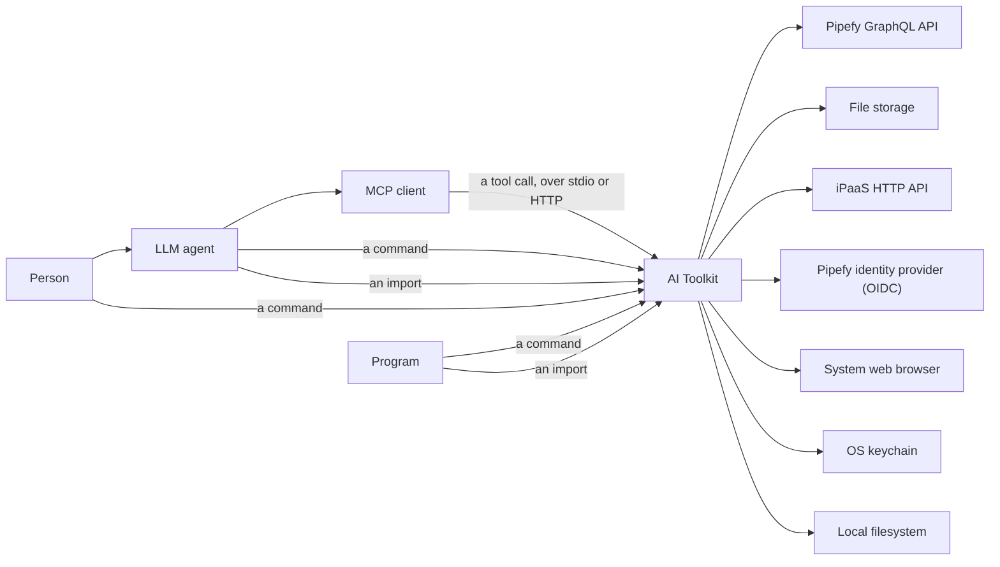
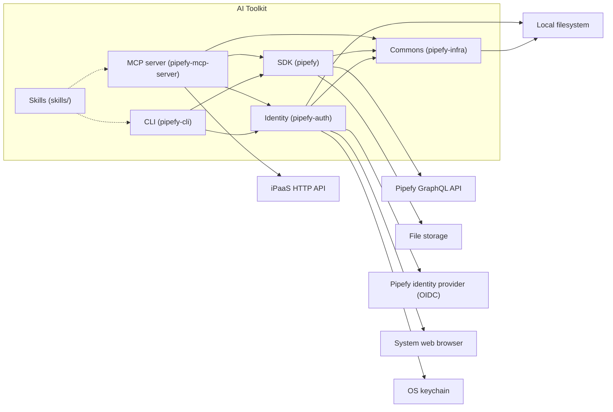
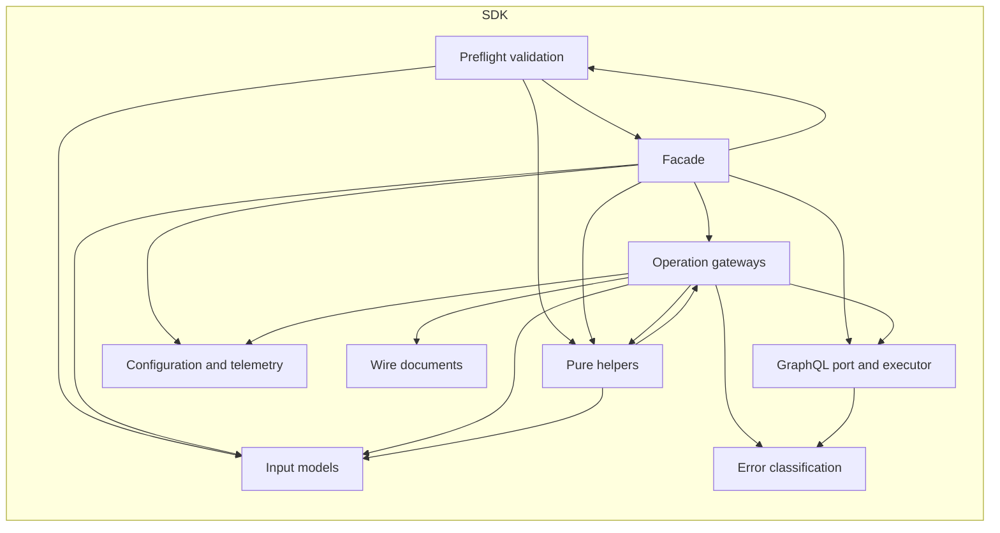
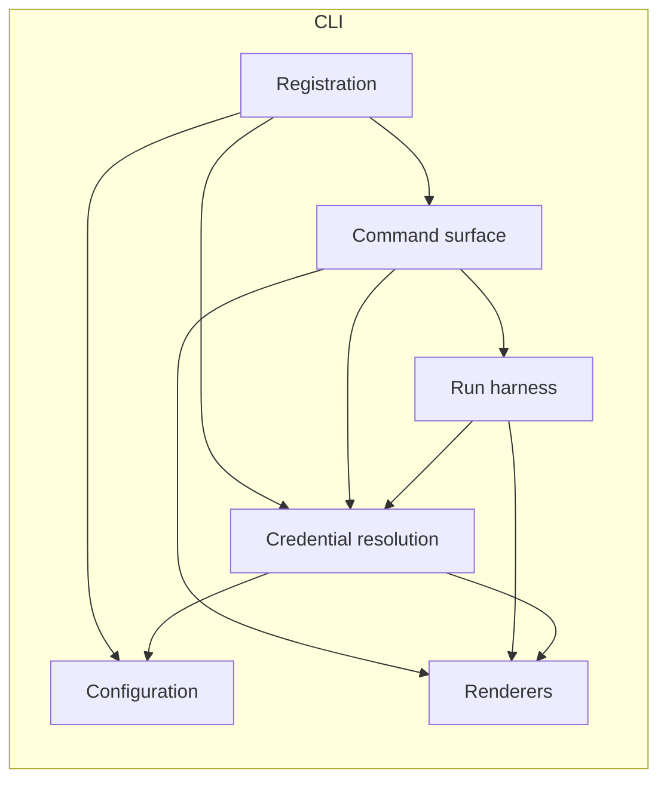
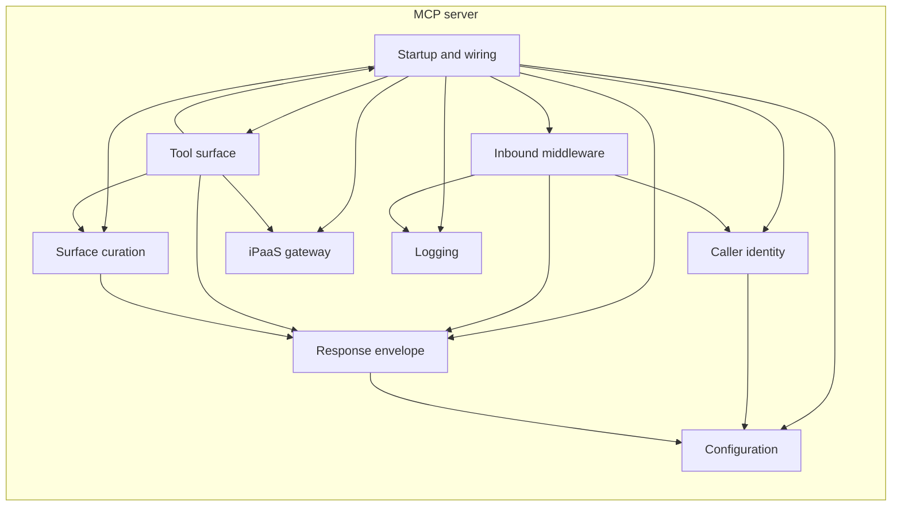
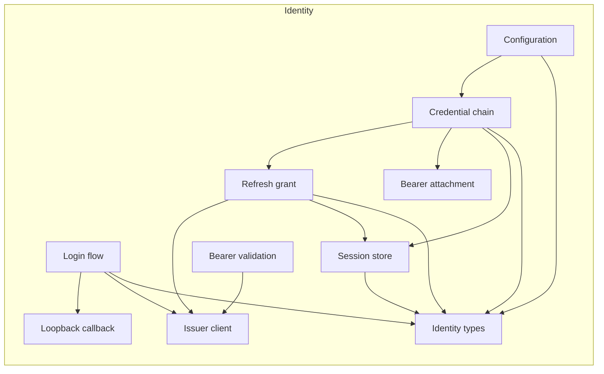
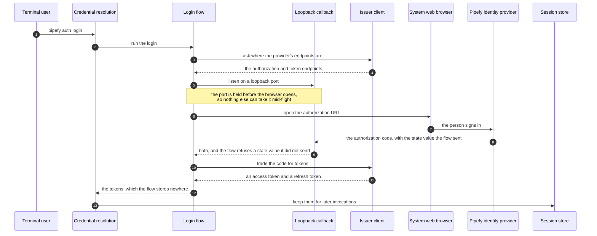
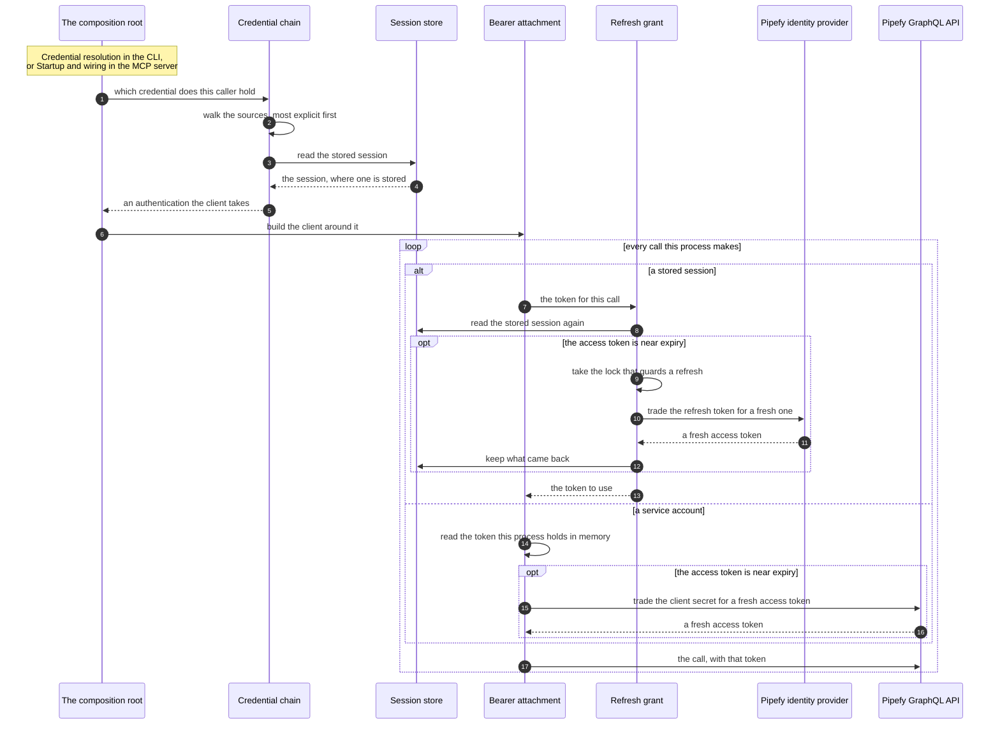
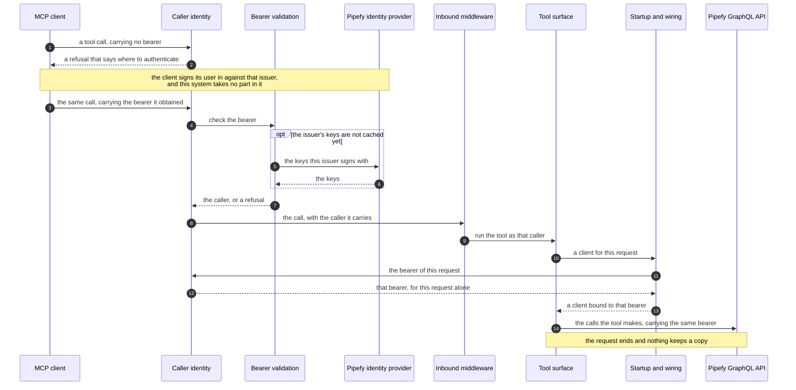
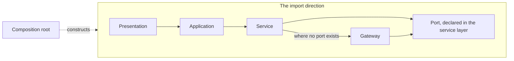

# AI Toolkit architecture

## Introduction and goals

This document maps the architecture of the AI Toolkit: an MCP server, a CLI, an SDK, and the skills that teach an agent to use them, all on top of Pipefy's public API.

### Requirements overview

Pipefy is fully invested in the AI ecosystem, and its own AI agents already execute work on a customer's processes. This toolkit opens the same reach to external AI agents, and to every consumer that does not act through Pipefy's website. In every component, two forces come first: what the people who prompt external agents expect, and the limits of their model. A programmer and a terminal user hold expectations of their own, and those only apply to the CLI and the SDK.

**Toolkit functions.** A caller who goes straight to Pipefy's API gets full product functionality, and its complexity with it. The toolkit gives the same functionality and keeps the complexity to itself. The functions below are what a caller gets for that trade. [Package decomposition](#package-decomposition) says which component delivers each function.

- `FR-1` Persistent sign-in. When a caller has no credential, the toolkit runs a browser sign-in, stores the result, and reuses it on later calls.
- `FR-2` Address by name. When a call identifies a resource by its name instead of its id, the toolkit finds that resource.
- `FR-3` Validation without execution. Before a change is applied, the toolkit validates it against the API rules, and applies nothing that fails.
- `FR-4` Schema discovery. The toolkit returns the part of the schema a call asks for, by keyword or by type name, and never the whole schema.
- `FR-5` iPaaS reach. The toolkit reaches the flows of a pipe's iPaaS workspace with no second credential for the engine behind them.
- `FR-6` Guided workflow. When an agent takes on a multi-step Pipefy workflow, the toolkit gives it the procedure as an installed playbook, and the agent runs each step through the MCP server or the CLI.

**Pipefy capabilities.** The list below is the toolkit's reach into the product. Each entry names a sub-domain of Pipefy's domain model, and gives only the operations the toolkit covers, not the whole sub-domain. Pipefy keeps that model internal, so an outside contributor cannot check a name against it, and must not invent one. The Domain expert row in [Stakeholders](#stakeholders) is the way to the model's owners.

- Work Execution: create a card, move it through the phases of a pipe, fill what a phase requires, comment on it, attach a file, and read or send its email.
- Process Modeling: create and change a pipe, its phases, its fields, its field conditions, its labels, and its automations. Create and change an AI agent, with the behaviors it runs and the knowledge it reads.
- Business Records: create and query a database table, its fields, and its records.
- Request Intake: the channel a requester submits through, and the portals, pages, elements, and sub-portals that make it up.
- Identity and Access Management: invite a member, set a role, and mint a service account.
- Governance and Audit: export a pipe's audit log, read an AI agent's logs, and choose the model provider it may use.
- Performance and Oversight: define a pipe or organization report, export it, and read usage and execution metrics.
- Billing: read the AI credits an organization consumed.
- System Integration: register a webhook, and reach an iPaaS flow.

### Quality goals

The table below ranks the qualities that dominate every decision on this map. Where two of them conflict, the higher row wins. Each row states why the goal earns its rank. [Solution strategy](#solution-strategy) states what the goal produced, and [Quality scenarios](#quality-scenarios) states what the goal demands.

| Priority | Quality goal | Why it ranks here |
|---|---|---|
| 1 | Authenticity | A hosted server holds sessions for many people at once, and every call reaches a customer's own Pipefy data (`QR-4`) |
| 2 | Resource utilization | A model pays for every call, and a long chain loses the thread before the work is done (`QR-5`) |
| 3 | Diagnosability | Nobody watches a run an agent starts, so a failure explains itself or the work stops (`QR-8`) |
| 4 | Stability | Pipefy owns the GraphQL schema, and this project does not (`QR-2`) |
| 5 | Backward compatibility | The toolkit ships in the open, so a caller we cannot see depends on the surface (`QR-11`) |

### Stakeholders

The table below says who the toolkit serves, and what each role expects. The contributor row is wider than its name. It holds what a tester, a code reviewer, and a developer would ask for, because this project has nobody who plays those parts separately. A contributor can also be an agent rather than a person.

| Role/Name | Description | Expectations |
|---|---|---|
| Programmer | A person who writes a program against the SDK, or a script against the CLI | The public surface and its deprecation policy, and what a command prints for a program to parse: [`docs/sdk`](../sdk/README.md), [`DEPRECATION.md`](../DEPRECATION.md), and [`docs/cli`](../cli/README.md) |
| Terminal user | A person who types a command | The command reference: [`docs/cli`](../cli/README.md) |
| MCP deployer | A person who wires an MCP client to the server, under the local profile or against a hosted one, and sets what the agent behind it may do | The tool catalog, what a destructive tool does before it runs, and where a credential lives: [`docs/mcp`](../mcp/README.md), [Tool surface](#tool-surface), and [Identity lifetime](#identity-lifetime) |
| LLM agent | A program that runs a model's decisions. It calls an MCP tool, it runs a CLI command in a shell, or it writes a program against the SDK | Per component. SDK: the public surface that the Programmer row names. CLI: a discoverable command set whose output it can parse and pipe into the next call ([`docs/cli`](../cli/README.md)). MCP: the tool descriptions the server publishes ([Tool surface](#tool-surface)). Skills: the playbooks in [`skills/`](../../skills/README.md) |
| Contributor | Anyone who opens a pull request, under [`CONTRIBUTING.md`](../../CONTRIBUTING.md) | Where a change goes, what it may import, and whether a passing test means anything: [Package decomposition](#package-decomposition), [Dependency rule](#dependency-rule), [`conventions.md`](conventions.md), and [`AGENTS.md`](../../AGENTS.md) |
| Maintainer | The core team, at `dev@pipefy.com` | A stack it controls, a layer order a merge cannot break, and a decision that outlives whoever made it: [Architecture decisions](#architecture-decisions), [Dependency rule](#dependency-rule), and [Declared dependencies](#declared-dependencies) |
| Security reviewer | Whoever answers `security@pipefy.com`, per [`SECURITY.md`](../../SECURITY.md) | Trust boundaries and outbound URL policy in every component, and then per component. SDK: stores no credential. CLI: stores one, so where it lives and who can read it. MCP: validates an inbound bearer, so how. Skills: nothing. [Identity lifetime](#identity-lifetime) and [Architecture constraints](#architecture-constraints) |
| Privacy, Legal and Compliance | Pipefy's review team, at `dpos@pipefy.com` | The three positions [`TERMS.md`](../../TERMS.md) defines: human review for a decision that affects an individual, a compliance card on every published blueprint, and Apache 2.0 for the code and the docs |
| Release manager | The maintainers who cut a release, at `dev@pipefy.com` | What counts as a breaking change, and what is owed before one ships: [`DEPRECATION.md`](../DEPRECATION.md) and [`RELEASE.md`](../../RELEASE.md) |
| Domain expert | The owners of Pipefy's internal domain model, reached through `dev@pipefy.com` | Names that match the Pipefy product: [Requirements overview](#requirements-overview) and [Glossary](#glossary) |
| Pipefy platform | The team that owns the GraphQL API, at [`community.pipefy.com/api-76`](https://community.pipefy.com/api-76) | A stated outbound policy: a caller that identifies itself, that does not chain calls it could make in one, that gives up rather than hold a connection open, and that honors a refusal to serve |
| Operator of the remote deployment | Whoever runs the remote profile. The hosted wrapper is built outside this repository, and no team is named here | For MCP alone, because no other component runs as a shared process. The deployment story: which tools a deployment exposes, where the credential comes from, who can use it, the deploy shape, what reaches a log, and what one caller costs another: [Identity lifetime](#identity-lifetime) |

Each Pipefy party confirmed its own row. The programmer, the terminal user, the MCP deployer, and the LLM agent rows are our reading of what each one needs, because this project cannot ask them. [GitHub Issues](https://github.com/pipefy/ai-toolkit/issues) is where one of them corrects a row.

## Architecture constraints

Every decision on this map works inside the constraints below. A limit that is not listed here binds no decision. Each row names the constraint, what it applies to, and where it comes from. Where another file holds the detail, a line under the table names that file.

A limit on technology goes under `Technical`. A limit from the organization, from a contract, or from law goes under `Organizational`. A rule we set for ourselves goes under `Conventions`.

We work inside a constraint rather than around it. When a limit blocks us, we negotiate with the party that set it. A widened limit lands as a decision record, and the record corrects the row. A lifted limit takes its row with it, and [Risks and technical debt](#risks-and-technical-debt) carries the code still written against it.

**Technical.**

| Constraint | Applies to | Explanation |
|---|---|---|
| Schema as the only instruction we can count on | MCP | The server owns the list it publishes, and the client alone decides how much of that list reaches the model. A playbook in `skills/` reaches the model only where a person installed it |
| A rate limit at the LLM vendor | CLI, MCP, Skills | The LLM vendor meters use over a rolling period, and a longer cap sits above the meter |
| A context window per call | CLI, MCP, Skills | The model carries a fixed window, so one call holds a bounded number of tokens whatever the meter allows |
| No guaranteed answer from the client | MCP | The protocol makes the client's side of a question optional. An answer can also come from the model or from a setting rather than from a person |
| Vendor-owned GraphQL shape | SDK, CLI, MCP | Pipefy's API team owns the entity shape and the error shape. A change serves every consumer of that API, so it needs the team's agreement and a deprecation cycle |
| A tool catalog we do not own | MCP | The iPaaS engine publishes its own tools, and their names and their shapes come from that engine |
| A deployment we do not build | MCP | Every deployment of the MCP server is built and run outside this repository, by Pipefy or by an MCP deployer |
| Python 3.11 as the floor | The repository | Python 3.9 left upstream support in late 2025, and 3.10 leaves it on 2026-10-31. Python 3.11 is therefore the oldest runtime that still receives a security fix |
| No assumed operating system | The repository | We chose to support an installation on macOS, Linux and Windows |
| No keychain in some environments | CLI, MCP | A container and a continuous-integration runner have no OS keychain |

[`docs/ipaas.md`](../ipaas.md) owns the tool catalog, and each `pyproject.toml` owns the Python floor.

**Organizational.**

| Constraint | Applies to | Explanation |
|---|---|---|
| Vendor-owned domain vocabulary | The repository | Pipefy's domain model names every entity, and Pipefy maintains that model outside this repository |
| Apache 2.0 for the code and the docs | The repository | Pipefy's Privacy, Legal and Compliance team chose Apache 2.0 for the source code and the documentation |
| A compatible license on every dependency | The repository | A package we depend on carries its own license terms, and some terms are incompatible with an Apache 2.0 distribution |
| A public repository | The repository | Pipefy publishes this repository, so every file in it and every past version is readable by anyone |
| A sign-off on every commit | The repository | Pipefy applies the Developer Certificate of Origin, which makes a contributor certify the origin of a change |
| A compliance review before a regulated skill merges | Skills | Pipefy's Privacy, Legal and Compliance team reviews a skill for a regulated industry, or one that decides about a person, before merge |
| A compliance card on a regulated blueprint | Skills | Pipefy's terms set the card, and the contribution rules require one on a blueprint for a regulated industry |

[`TERMS.md`](../../TERMS.md) owns the license notice, and [`CONTRIBUTING.md`](../../CONTRIBUTING.md) owns the sign-off, the review and the card. The compatible-license row has no file and no check behind it, so a reviewer applies it before a new dependency lands.

**Conventions.**

Every rule we set for ourselves lives in a file of its own, so this block has no table. [`conventions.md`](conventions.md) owns the code rules, each under a permanent ID that a review cites, and [`authoring.md`](authoring.md) owns the documentation rules. [`CONTRIBUTING.md`](../../CONTRIBUTING.md) owns the rules for a skill, a commit and a pull request, and [`RELEASE.md`](../../RELEASE.md) and [`DEPRECATION.md`](../DEPRECATION.md) own the rules for a version and a release. [`AGENTS.md`](../../AGENTS.md) owns the rules for a contributing agent and routes the agent to the file that owns each rule.

## Context and scope

In domain terms, the toolkit acts on the Pipefy organizations that a caller can access, and each call runs under the caller's membership in one of them. Inside an organization, a pipe holds the definition of a process and a card is one run of that process. A database table holds records of the business entities a process uses. Unlike a card, a record has no lifecycle of its own, because it moves through no phases.

[Requirements overview](#requirements-overview) names every capability the toolkit reaches on pipes, cards, tables and records, and the GraphQL schema owns the shape of each. A flow of the iPaaS is the exception, because it runs on a separate engine, so the `Vocabulary` section of [`docs/ipaas.md`](../ipaas.md) defines it.

The diagram draws the toolkit as one box, with every party it exchanges data with. The box holds the components of the toolkit, which are the SDK, the CLI, the MCP server and the skills.

```mermaid
flowchart LR
    toolkit["AI Toolkit"]

    person["Person"] --> agent["LLM agent"]
    agent --> client["MCP client"]
    client -- "a tool call, over stdio or HTTP" --> toolkit
    agent -- "a command" --> toolkit
    agent -- "an import" --> toolkit
    person -- "a command" --> toolkit
    program["Program"] -- "a command" --> toolkit
    program -- "an import" --> toolkit

    toolkit --> graphql["Pipefy GraphQL API"]
    toolkit --> storage["File storage"]
    toolkit --> ipaas["iPaaS HTTP API"]
    toolkit --> idp["Pipefy identity provider (OIDC)"]
    toolkit --> browser["System web browser"]
    toolkit --> keychain["OS keychain"]
    toolkit --> files["Local filesystem"]
```

The table lists the parties that the toolkit depends on, and which components reach each one, because no component works with every party. The skills appear in no row, because a playbook runs no code of its own.

| Party | Reached by | What crosses |
|---|---|---|
| Pipefy GraphQL API | SDK, CLI, MCP | Every capability in [Requirements overview](#requirements-overview) except an iPaaS flow |
| File storage | SDK, CLI, MCP | The bytes of an attachment, up and down |
| iPaaS HTTP API | MCP | The flows of a pipe's iPaaS workspace, and the token exchange that reaches them |
| Pipefy identity provider (OIDC) | CLI, MCP | A login, and the validation of an inbound bearer |
| System web browser | CLI | A login handed off, and the authorization code that comes back |
| OS keychain | CLI, MCP | A stored credential |
| Local filesystem | SDK, CLI, MCP | A config file, a stored credential, and the bytes of a local file |

Where a crossing has a port, [Ports and dependency inversion](#ports-and-dependency-inversion) names it.

## Solution strategy

The table below holds the decisions that the rest of this map rests on. Every goal that [Quality goals](#quality-goals) ranks produced a row, and those rows come first, in rank order. The rows after them answer an expectation in [Stakeholders](#stakeholders), a quality requirement, or a constraint in [Architecture constraints](#architecture-constraints).

| Driver | Decision | Details |
|---|---|---|
| Authenticity | The toolkit delegates identity to Pipefy and scopes each credential to one caller | [Identity lifetime](#identity-lifetime) |
| Resource utilization | Tools express outcomes, not endpoints, and a deployment lists only what it selected | [Tool surface](#tool-surface) |
| Diagnosability | A failure reports its likely cause and the next step in the reply itself | [Response shape](#response-shape) |
| Stability | The SDK answers in types of its own, so a change to the GraphQL schema stops inside the SDK | [SDK](#sdk), [Ports and dependency inversion](#ports-and-dependency-inversion) |
| Backward compatibility | From v1.0, the published packages follow semantic versioning, so a documented contract breaks only in a major release | [`DEPRECATION.md`](../DEPRECATION.md) |
| Callers whose needs differ by how they use the toolkit | The toolkit offers a separate component for each way a caller uses it, over libraries they share, so a caller installs only the one it uses | [Package decomposition](#package-decomposition) |
| A change to shared behavior that lands as one reviewed change (`QR-26`) | Every package lives in one repository and ships on one version | [`RELEASE.md`](../../RELEASE.md) |
| A public repository | The repository holds no credential, so a deployment reads its credentials from its own environment | [Architecture constraints](#architecture-constraints), [`docs/config.md`](../config.md) |

## Building block view

[Package decomposition](#package-decomposition) holds level 1, which is the components and the shared libraries beneath them, and [Inside each package](#inside-each-package) holds level 2.

### Package decomposition

Each way that a caller can use the toolkit is a separate component. A program imports the SDK. A person or an agent runs a CLI command in a shell. An agent calls an MCP tool through its MCP client. A skill is a playbook installed into the agent, and it teaches the agent which tools and commands to call. Each component serves a different need, which [Stakeholders](#stakeholders) states per component, so each one changes for its own reason. Beneath the components sit libraries that hold what more than one of them needs.

```mermaid
flowchart LR
    subgraph toolkit["AI Toolkit"]
        direction TB
        skills["Skills (skills/)"]
        mcp["MCP server (pipefy-mcp-server)"]
        cli["CLI (pipefy-cli)"]
        sdk["SDK (pipefy)"]
        auth["Identity (pipefy-auth)"]
        infra["Commons (pipefy-infra)"]

        skills -.-> mcp
        skills -.-> cli
        mcp --> sdk
        mcp --> auth
        mcp --> infra
        cli --> sdk
        cli --> auth
        sdk --> infra
        auth --> infra
    end

    sdk --> graphql["Pipefy GraphQL API"]
    sdk --> storage["File storage"]
    mcp --> ipaas["iPaaS HTTP API"]
    auth --> idp["Pipefy identity provider (OIDC)"]
    auth --> browser["System web browser"]
    auth --> keychain["OS keychain"]
    auth --> files["Local filesystem"]
    infra --> files
```

The legend:

- An arrow between two packages points from the package that declares the dependency to the package it depends on, and [Dependency rule](#dependency-rule) holds those arrows pointing one way.
- A dashed arrow is a naming dependency rather than a declared one. A skill names only a registered tool or a registered command, and a build check holds that. The check carries its own list of the commands, which [Risks and technical debt](#risks-and-technical-debt) records.

The cost of an install divided the shared code into Identity and Commons. Because `packages/sdk/pyproject.toml` declares `pipefy-infra` and not `pipefy-auth`, a program that imports the SDK installs no keychain and no crypto stack. `packages/infra/pyproject.toml` declares `pydantic` and `pydantic-settings` and nothing else, so every package takes them cheaply. A single shared package would put the login machinery in every SDK install.

`QR-23` forbids a tool description that carries a procedure. A model still needs the procedure, so the procedure ships as a playbook beside the code, and the playbook names the tools of the MCP server and the commands of the CLI.

| Name | Functions | Responsibility | Interfaces | Code |
|---|---|---|---|---|
| SDK | `FR-3` | Executes a named operation deterministically and returns a domain value | The package root | `packages/sdk` |
| CLI | `FR-1`, `FR-2`, `FR-3`, `FR-4` | Serves the domain to a command whose output the next command can parse | A command in a shell | `packages/cli` |
| MCP server | `FR-1`, `FR-2`, `FR-3`, `FR-4`, `FR-5` | Serves the domain to a call that states an intent | A tool call, over stdio or HTTP | `packages/mcp` |
| Skills | `FR-6` | Teaches an LLM agent a Pipefy workflow over the MCP server and the CLI, and carries the procedure that a tool description must not | A `SKILL.md` installed into an agent harness | `skills/` |
| Identity | `FR-1` | Owns every credential operation: a browser login, storage, and the validation of an inbound bearer | The package root | `packages/auth` |
| Commons | none | Holds what carries no Pipefy concept and what more than one package needs, which today is coercion, configuration discovery, local file reads, URL checks, and telemetry headers | The package root | `packages/infra` |

### Inside each package

Commons and Skills have no section here. Commons holds helpers that are not related to each other, and [`skills/README.md`](../../skills/README.md) owns the skills catalog while each `SKILL.md` owns its steps.

#### SDK

The diagram and the table below divide the SDK into blocks by responsibility. A folder mostly holds one block, but the package root holds a facade, a service, a port, and domain types side by side, so the `Code` column lists the modules of each block.

```mermaid
flowchart TB
    subgraph sdk["SDK"]
        direction TB
        preflight["Preflight validation"]
        facade["Facade"]
        services["Operation gateways"]
        documents["Wire documents"]
        port["GraphQL port and executor"]
        models["Input models"]
        errors["Error classification"]
        helpers["Pure helpers"]
        config["Configuration and telemetry"]
    end

    preflight --> facade
    preflight --> helpers
    preflight --> models
    facade --> preflight
    facade --> services
    facade --> port
    facade --> models
    facade --> helpers
    facade --> config
    services --> documents
    services --> port
    services --> models
    services --> helpers
    services --> errors
    services --> config
    helpers --> services
    helpers --> models
    port --> errors
```

The legend:

- An arrow points from a block to a block that it imports from.

The SDK is a library, so it owns no composition root: the caller wires it, and the facade constructs the gateways that it delegates to.

| Name | Role | Responsibility | Interfaces | Code |
|---|---|---|---|---|
| Facade | Service, as the published facade | Constructs each gateway, and delegates one call per public method | `PipefyClient`, at a package root that a check holds closed | `client.py` |
| Preflight validation | Service | Validates a change against the API rules before the change runs, which is `FR-3` | Public functions, run ahead of the change | `ai_preflight.py`, `ai_pipe_validation.py`, `ai_phase_transition_validation.py`, `automation_preflight.py` |
| Operation gateways | Gateway, with a service inside the few that fan out | Runs a named operation against the Pipefy API, where a few of them fan out over several calls | One method per named operation, which the facade delegates to | `services/`, and `utils/organization_identifiers.py` |
| Wire documents | Gateway | Holds the GraphQL document that each gateway sends | A document that a gateway imports | `queries/` |
| GraphQL port and executor | Service port, with a gateway behind it | Declares the `GraphQLExecutor` port, and ships the authenticated implementation behind it | The port that a gateway takes, and the transport that fulfills it | `graphql_executor.py` |
| Input models | Service, as a domain type | Validates the input, before any call leaves | A pydantic model that a public method takes | `models/` |
| Error classification | Service, as a domain type | Turns a GraphQL problem into a typed exception | The exception hierarchy, and the problem parser behind it | `exceptions.py`, `graphql_problem.py` |
| Pure helpers | Service, as a domain type | Filters a field, reads a phase inventory, formats a hint, and picks a label color, with no I/O | Functions that a gateway or the package surface calls | `field_filters.py`, `phase_inventory.py`, `transition_hints.py`, `label_color.py`, `behavior_placeholders.py`, `automation_input.py`, `report_filter_preflight.py`, and the rest of `utils/` |
| Configuration and telemetry | Service, as a domain type | Holds the parsed configuration, and builds the outbound headers that name the caller | A settings object, and the `User-Agent` that every request carries | `settings.py`, `telemetry.py` |

#### CLI

The diagram and the table below divide the CLI into blocks by responsibility. The folders group files by kind instead, so a block cuts across them, and the `Code` column lists the files of each block.

```mermaid
flowchart TB
    subgraph cli["CLI"]
        direction TB
        registration["Registration"]
        surface["Command surface"]
        harness["Run harness"]
        credentials["Credential resolution"]
        renderers["Renderers"]
        config["Configuration"]
    end

    registration --> surface
    registration --> credentials
    registration --> config
    surface --> harness
    surface --> credentials
    surface --> renderers
    harness --> credentials
    harness --> renderers
    credentials --> renderers
    credentials --> config
```

The legend:

- An arrow points from a block to a block that it imports from.

The command surface spans presentation and application, because the command body that Typer registers also runs the SDK calls behind the command.

| Name | Role | Responsibility | Interfaces | Code |
|---|---|---|---|---|
| Registration | Composition root | Registers every command group, parses the global flags, and picks the keychain backend | The `pipefy` entry point | `main.py` |
| Command surface | Presentation and application | Declares the command with its flags, then orchestrates the SDK calls behind it | One command group per resource | `commands/<resource>.py`, apart from `commands/auth.py` |
| Run harness | Presentation | Runs a command body, validates a shared argument, maps an exception to an exit code, and calls the chosen renderer | A wrapper that every command body runs inside | The run harness, the shared validators, and the confirmation prompt in `commands/_common.py` |
| Credential resolution | Composition root | Resolves the credential precedence chain, builds the authenticated client, and says what a keychain failure means | The `auth` command group, and the client that a command body receives | `auth.py`, `commands/auth.py`, `commands/_auth_keychain_hints.py`, and the client build in `commands/_common.py` |
| Renderers | Presentation | Writes JSON lines for a script, or a Rich table for a person | Two renderers, one of which the run harness picks per call | `output/` |
| Configuration | Service, as a domain type | Holds the parsed configuration, and the documentation reference that an error message points at | A settings object that every block reads | `settings.py`, `_docs.py` |

#### MCP server

The diagram and the table below divide the MCP server into blocks by responsibility. The folders group files by kind instead, so a block cuts across them, and the `Code` column lists the files of each block.

```mermaid
flowchart TB
    subgraph server["MCP server"]
        direction TB
        startup["Startup and wiring"]
        middleware["Inbound middleware"]
        surface["Tool surface"]
        curation["Surface curation"]
        envelope["Response envelope"]
        caller["Caller identity"]
        gateway["iPaaS gateway"]
        logging["Logging"]
        config["Configuration"]
    end

    startup --> middleware
    startup --> surface
    startup --> curation
    startup --> envelope
    startup --> caller
    startup --> gateway
    startup --> logging
    startup --> config
    middleware --> caller
    middleware --> envelope
    middleware --> logging
    surface --> curation
    surface --> envelope
    surface --> gateway
    surface --> startup
    curation --> envelope
    caller --> config
    envelope --> config
```

The legend:

- An arrow points from a block to a block that it imports from.

The tool surface spans presentation and application, because the tool body that `@mcp.tool` registers also runs the calls behind the tool. Startup and wiring is the [composition root](#composition-root): it imports and builds every other block, so it sits off the stack.

| Name | Role | Responsibility | Interfaces | Code |
|---|---|---|---|---|
| Tool surface | Presentation and application | Declares each tool with its annotations, parses the arguments, orchestrates the calls behind it, and decides what the answer says | A registered tool, called over stdio or HTTP | `tools/*_tools.py` apart from `tools/meta_tools.py`, the `tools/*_tool_helpers.py` beside them, `tools/phase_transition_helpers.py`, `tools/field_condition_planner.py`, `tools/behavior_placeholder_interpolation.py` |
| Surface curation | Service, with a presentation face for the discovery tools | Decides which tools a deployment exposes, by subject domain, by persona profile, and by the remote marker, and holds a destructive call behind a confirmation | The `--toolsets` flag, the `meta=REMOTE` marker, and the discovery tools of the `power` profile | `tools/toolsets.py`, `tools/remote_profile.py`, `tools/meta_tools.py`, `tools/destructive_tool_guard.py`, `tools/mcp_capabilities.py` |
| Inbound middleware | Presentation | Wraps every inbound call before a tool body runs, and carries the logging, the quota, and the protection of what sits downstream | An ordered chain that the composition root builds | `core/tool_middleware.py`, `observability/request_log_middleware.py`, `observability/tool_log_middleware.py` |
| Response envelope | Presentation | Builds the single response shape that every tool returns, for a success, for an error, and for a page | Functions that a tool body calls, and one patch that startup installs | `tools/validation_envelope.py`, `core/tool_error_envelope.py`, `tools/graphql_error_helpers.py`, `tools/pagination_helpers.py`, `tools/validation_helpers.py` |
| Caller identity | Gateway | Holds the startup identity and the request-scoped identity, and validates an inbound bearer against the issuer | The identity that a tool body reads from its request context | `auth/` |
| iPaaS gateway | Gateway | Reaches a pipe's iPaaS workspace over HTTP | An async client that a tool body calls | `core/ipaas_gateway.py` |
| Logging | Gateway | Writes one JSON line per event to the log stream | A configured logger | `observability/json_logging.py` |
| Startup and wiring | Composition root | Parses the startup flags, builds every effect once, assembles the tool surface, and hands each request the objects it needs | The `pipefy-mcp-server` entry point | `main.py`, `server.py`, `core/runtime.py`, `core/transport_security.py`, `observability/wiring.py`, `tools/registry.py`, `tools/tool_context.py` |
| Configuration | Service, as a domain type | Holds the parsed configuration, and the documentation reference that an error message points at | A settings object that every block reads | `settings.py`, `_docs.py` |

#### Identity

The diagram and the table below divide Identity into blocks by responsibility, along the direction that a credential travels. Most blocks obtain a credential and attach it to an outbound call, and Bearer validation checks a credential that arrives from outside.

```mermaid
flowchart TB
    subgraph identity["Identity"]
        direction TB
        flow["Login flow"]
        loopback["Loopback callback"]
        chain["Credential chain"]
        refresh["Refresh grant"]
        store["Session store"]
        issuer["Issuer client"]
        attach["Bearer attachment"]
        verify["Bearer validation"]
        types["Identity types"]
        config["Configuration"]
    end

    flow --> loopback
    flow --> issuer
    flow --> types
    chain --> refresh
    chain --> attach
    chain --> store
    chain --> types
    refresh --> issuer
    refresh --> store
    refresh --> types
    store --> types
    verify --> issuer
    config --> chain
    config --> types
```

The legend:

- An arrow points from a block to a block that it imports from.

The login flow starts the loopback callback and stops it again, so a service owns an inbound gateway for the length of one login.

| Name | Role | Responsibility | Interfaces | Code |
|---|---|---|---|---|
| Credential chain | Service, as the published facade | Decides which credential the caller holds, which is a static token, a service account, or a stored session, and builds the authentication that a client takes | `resolve_pipefy_auth`, which every application calls, and the message that states what is missing | `resolver.py` |
| Login flow | Service | Runs the browser login end to end, which is `FR-1`, and returns the tokens without storing them | The `pipefy auth login` command reaches it through the package root | `flow.py` |
| Loopback callback | Gateway, inbound | Serves the one redirect that the browser sends back on a loopback port, then stops | A redirect URI on localhost, with a port that the flow picks | `loopback.py` |
| Issuer client | Gateway | Finds the OIDC endpoints, exchanges a code, and revokes a token | The endpoints that discovery returns, over one shared HTTP client | `discovery.py`, `revoke.py`, `_http.py` |
| Refresh grant | Service | Trades a refresh token for a fresh access token, under a lock that keeps two processes from racing | A refreshed token, and the lock file that guards it | `refresh.py`, `locks.py` |
| Session store | Gateway | Writes the session to the OS keychain, and falls back to a file where no keychain exists | The stored session that the chain and the refresh grant read | `storage.py` |
| Bearer attachment | Gateway | Attaches `Authorization: Bearer` to an outbound request, and refreshes the token when it expires | An `httpx.Auth` that a client takes | `bearer.py` |
| Bearer validation | Service | Validates a bearer that arrives from outside, against the issuer's keys | The check that the MCP server runs on an inbound call | `verification.py` |
| Identity types | Service, as a domain type | Holds the OIDC client identity, the parsed token response, and the PKCE pair, with no I/O | Types that every block above takes | `identity.py`, `responses.py`, `pkce.py` |
| Configuration | Service, as a domain type | Holds the parsed authentication settings, and the settings that the inbound check reads | `AuthSettings` and `JwtValidationSettings` | `settings.py` |

## Runtime view

Each scenario below follows one credential lifetime: resolved once per process, or once per request. The lifetime decides whether code downstream may keep the credential it received, as [Identity lifetime](#identity-lifetime) states.

### A credential resolved once per process

The CLI resolves its credential once per command, and the MCP server under the local profile resolves it once at startup. One caller owns the process, so the credential lasts as long as the process does. Before either one runs, a person logs in once through the CLI, which is `FR-1`.

```mermaid
sequenceDiagram
    autonumber
    participant Person as Terminal user
    participant Resolution as Credential resolution
    participant Flow as Login flow
    participant Loopback as Loopback callback
    participant Issuer as Issuer client
    participant Browser as System web browser
    participant Idp as Pipefy identity provider
    participant Store as Session store

    Person->>Resolution: pipefy auth login
    Resolution->>Flow: run the login
    Flow->>Issuer: ask where the provider's endpoints are
    Issuer-->>Flow: the authorization and token endpoints
    Flow->>Loopback: listen on a loopback port
    Note over Flow,Loopback: the port is held before the browser opens,<br/>so nothing else can take it mid-flight
    Flow->>Browser: open the authorization URL
    Browser->>Idp: the person signs in
    Idp-->>Loopback: the authorization code, with the state value the flow sent
    Loopback-->>Flow: both, and the flow refuses a state value it did not send
    Flow->>Issuer: trade the code for tokens
    Issuer-->>Flow: an access token and a refresh token
    Flow-->>Resolution: the tokens, which the flow stores nowhere
    Resolution->>Store: keep them for later invocations
```

After the login, a credential resolves without asking the person anything.

```mermaid
sequenceDiagram
    autonumber
    participant Entry as The composition root
    participant Chain as Credential chain
    participant Store as Session store
    participant Attach as Bearer attachment
    participant Refresh as Refresh grant
    participant Idp as Pipefy identity provider
    participant Api as Pipefy GraphQL API

    Note over Entry: Credential resolution in the CLI,<br/>or Startup and wiring in the MCP server
    Entry->>Chain: which credential does this caller hold
    Chain->>Chain: walk the sources, most explicit first
    Chain->>Store: read the stored session
    Store-->>Chain: the session, where one is stored
    Chain-->>Entry: an authentication the client takes
    Entry->>Attach: build the client around it
    loop every call this process makes
        alt a stored session
            Attach->>Refresh: the token for this call
            Refresh->>Store: read the stored session again
            opt the access token is near expiry
                Refresh->>Refresh: take the lock that guards a refresh
                Refresh->>Idp: trade the refresh token for a fresh one
                Idp-->>Refresh: a fresh access token
                Refresh->>Store: keep what came back
            end
            Refresh-->>Attach: the token to use
        else a service account
            Attach->>Attach: read the token this process holds in memory
            opt the access token is near expiry
                Attach->>Api: trade the client secret for a fresh access token
                Api-->>Attach: a fresh access token
            end
        end
        Attach->>Api: the call, with that token
    end
```

When a refresh fails, the call fails. No other source answers in its place, because the caller already chose this one, and a silent swap would act as somebody else, which `QR-4` forbids.

[`docs/cli/auth.md`](../cli/auth.md) owns the steps for each source, and what a failed step reports.

### A credential resolved once per request

The MCP server under the remote profile resolves a credential once per request. One process serves many callers at the same time, so no credential can belong to the process.

The MCP client signs its user in with the issuer and holds the bearer that the issuer returns. The server is a resource server: it accepts a bearer, checks it, and acts on it, and it issues none. So the first scenario's login has no counterpart here.

```mermaid
sequenceDiagram
    autonumber
    participant Client as MCP client
    participant Caller as Caller identity
    participant Verify as Bearer validation
    participant Idp as Pipefy identity provider
    participant Middleware as Inbound middleware
    participant Tool as Tool surface
    participant Startup as Startup and wiring
    participant Api as Pipefy GraphQL API

    Client->>Caller: a tool call, carrying no bearer
    Caller-->>Client: a refusal that says where to authenticate
    Note over Client,Idp: the client signs its user in against that issuer,<br/>and this system takes no part in it
    Client->>Caller: the same call, carrying the bearer it obtained
    Caller->>Verify: check the bearer
    opt the issuer's keys are not cached yet
        Verify->>Idp: the keys this issuer signs with
        Idp-->>Verify: the keys
    end
    Verify-->>Caller: the caller, or a refusal
    Caller->>Middleware: the call, with the caller it carries
    Middleware->>Tool: run the tool as that caller
    Tool->>Startup: a client for this request
    Startup->>Caller: the bearer of this request
    Caller-->>Startup: that bearer, for this request alone
    Startup-->>Tool: a client bound to that bearer
    Tool->>Api: the calls the tool makes, carrying the same bearer
    Note over Tool,Api: the request ends and nothing keeps a copy
```

A caller who arrives with no bearer gets a refusal that names this resource and the issuer that guards it, so the client finds where to authenticate without being configured for it. The MCP SDK writes that refusal and serves the metadata behind it, and the composition root supplies both names.

Bearer validation also checks that the bearer was issued for this resource and not for another one. That check is `QR-16`, and [Risks and technical debt](#risks-and-technical-debt) records that it is off by default today.

This scenario serves `QR-4`, which [Quality goals](#quality-goals) ranks first, so two callers on one process each act as themselves. [Identity lifetime](#identity-lifetime) states the rule that follows for code.

## Cross-cutting concepts

The concepts below cross the building blocks, so none of them sits under one. Where a concept differs between components, its `By component` block says how.

### Dependency rule

The stack serves `QR-2`, because a vendor change stops at the layer that wraps the vendor. It has four layers, top to bottom, which is the path a call travels:

- Presentation. What the outside touches, and what shapes the answer that goes back out. Framework and third-party SDK imports live here.
- Application. Intent and orchestration, which is which operations run to satisfy one request.
- Service. The domain rules and the domain types. It owns the ports that it needs from the outside, and it imports no framework and no third-party SDK.
- Gateway. The outbound effect, which is the network, the keychain, the file system, and the log stream. Framework and third-party SDK imports live here too.

An application holds all four layers, because it turns a caller's intent into operations. A library holds the bottom two, because it executes a named operation, so the SDK and Identity hold no application layer.

Between packages, an import follows the direction of the level-1 diagram, and neither the MCP server nor the CLI imports the other or the private modules of the SDK. Ruff `TID251` holds that rule, from a list in each package's `pyproject.toml`.

Within the MCP package, import-linter holds the folder order `server > tools > core > auth > settings`, which is `QR-14`.

Inside a package, `MODULE-1` and `MODULE-2` in [`conventions.md`](conventions.md) place a module by its layer, and an import follows the stack except on the bottom edge. Where that edge carries a port, the service layer declares the port and a gateway fulfills it, so the gateway imports the service layer. `PORT-1` to `PORT-3` decide which edges earn a port. A facade takes the position of the layer it publishes. [ADR-0001](adr/0001-layered-responsibility.md) holds the reasoning. No package checks this order, because the folder order above is the only contract, and [Risks and technical debt](#risks-and-technical-debt) states what that leaves unheld.

```mermaid
flowchart LR
    root["Composition root"]
    subgraph chain["The import direction"]
        direction LR
        presentation["Presentation"] --> application["Application"]
        application --> service["Service"]
        service --> port["Port, declared in the service layer"]
        gateway["Gateway"] --> port
        service -->|"where no port exists"| gateway
    end
    root -.->|constructs| chain
```

The legend:

- A solid arrow points from a layer to what that layer imports.
- The dotted arrow is construction. The composition root builds every layer, so it imports across the stack and sits off it.

### Declared dependencies

**What a package declares.** A package declares every dependency that its own code imports, even one that another dependency already installs. That other dependency can stop installing it in any release, and nothing in this repository detects the change. [Risks and technical debt](#risks-and-technical-debt) carries where the rule is broken today.

**How a version is bounded.** A third-party dependency states a minimum version and a maximum version, and the maximum stops before the next major release, as in `>=2.13.4,<3`. A major release can change behavior that this code depends on, and no other check catches that change. [Risks and technical debt](#risks-and-technical-debt) carries the dependencies that state no maximum today.

A dependency can instead be pinned to one minor series, but only where this code uses parts of it that its version numbers do not protect, as `mcp` is in `packages/mcp/pyproject.toml`.

A package depends on another package of this workspace at one exact version, as [`RELEASE.md`](../../RELEASE.md) rules and `QR-26` demands.

### Ports and dependency inversion

The repository owns these ports today, and a test injects a fake against each, which is `QR-13`:

- `GraphQLExecutor`, which the SDK services take in place of the GraphQL client.
- `S3Uploader`, which the attachment service takes to upload bytes to a presigned URL.
- `UrlDownloader`, which the attachment service takes to fetch bytes from a URL that the caller supplies.

The iPaaS gateway has no port, and [Risks and technical debt](#risks-and-technical-debt) carries it.

### Composition root

Each application has its own composition root. At startup, it parses the environment, the config file, and the startup flags into decisions. It also performs every startup effect, such as a keychain read or a network call, and builds the clients that the rest of the code uses. Downstream code then receives a decision it can rely on, and never a raw value it must read again. That parse is `QR-1` applied to configuration, under `VALID-2` in [`conventions.md`](conventions.md), so an invalid value fails at startup and not in the code that later reads it.

Inside an application, code outside the composition root does not construct a client: it gets one from the root. A shared package supplies the parts that a root assembles, such as parsed types and credential resolvers, and it wires nothing itself. Each application decides whether its root builds a client at startup or when the code first needs it.

**By component.**

- SDK: owns no composition root, because it is a library. A caller passes it settings and a credential, and the facade builds the gateways behind it from those.
- CLI: parses its startup input at its entry point and builds the client when a command first needs it.
- MCP: parses its startup input at its entry point and builds its runtime at startup in `core/runtime.py`. The runtime opens a session for each request.
- Skills: not reached.

### Identifier resolution

An identifier names a resource, and it takes one of several forms: a numeric ID, a UUID, a slug, or the resource's name.

`ARG-1` in [`conventions.md`](conventions.md) holds each argument to one form, and [`docs/mcp/tools/identifiers.md`](../mcp/tools/identifiers.md) names the form that each MCP tool argument takes. [ADR-0002](adr/0002-typed-single-form-contract.md) holds the reasoning.

The SDK finds the matches for a name, and it tolerates a name that is incomplete or misspelled, which is `QR-28`. [Risks and technical debt](#risks-and-technical-debt) states which searches reach that tolerance today.

The choice between the matches sits above the SDK, because it is a decision, and `QR-7` leaves that decision with the caller. Today the caller searches first and then calls a tool with the ID it chose, so one outcome that a user wants costs an extra call. [ADR-0003](adr/0003-mcp-tools-express-outcomes.md) lets an MCP tool take the name itself and ask the client to choose when the name fits more than one resource. The `QR-5` entry in [Risks and technical debt](#risks-and-technical-debt) carries that extra call until then.

### Asking the caller

Before it acts, a tool can lack data, which is what to act on, or permission, which is whether to act at all. A tool asks the caller for data. Permission belongs to the party that faces the person: the client for an MCP tool, and the CLI itself at a terminal.

An MCP tool asks for data through the client, which is `QR-22`. The client puts the question to the person and returns the answer without a second call from the model, whereas a question that the tool returns to the model costs another call, so `QR-22` also serves `QR-5`. Not every client can take a question, and [Risks and technical debt](#risks-and-technical-debt) states which clients a tool can ask and what a tool does with the rest.

A run with nobody present must not wait for an answer, which is `QR-3`. Permission never makes it wait, because the deployer settled permission in the client's settings before the run began, and `QR-25` stops a call only where they chose. Data can make it wait, because nobody can settle a value in advance, so here `QR-22` conflicts with `QR-3`. `QR-3` wins: where the tool cannot ask and more than one answer fits, the call fails and names the input it lacked, so the caller can supply it and call again. [Risks and technical debt](#risks-and-technical-debt) carries the tools that go ahead without saying so today.

Around an MCP tool, each party does what only it can do:

- The MCP server states what a tool changes, both in the tool's description and in its annotations.
- The client then decides whether a human sees that statement, under settings that the human chose.
- Pipefy's API authorizes the call, so it alone can refuse one.
Today a destructive MCP tool also gates itself behind a second call that sets `confirm`, and [Risks and technical debt](#risks-and-technical-debt) carries that gap.

**By component.**

- SDK: asks nobody, and a missing input is an exception that the program handles.
- CLI: asks a person at the terminal for permission before a destructive command, and `--yes` gives it in advance. It never asks for data, so a missing input is a usage error.
- MCP: asks for data through the client, and leaves permission to the client.
- Skills: teach the `confirm` second call that a destructive MCP tool requires today.

### Tool surface

A deployment chooses which tools it lists, apart from what the catalog holds, which is `QR-9`. The choice matters because the listing spends the model's context window, which [Architecture constraints](#architecture-constraints) bounds. The client alone decides how much of the listing reaches the model, so the server assumes that all of it does. The listing spends the window on the number of tools and on the words in each. `QR-23` bounds the words, and [Risks and technical debt](#risks-and-technical-debt) carries the missing bound on the number.

A domain is the one subject that a tool is about, and every registered tool belongs to exactly one domain. A test holds that rule by tool name, so only a review catches a tool filed under the wrong domain. A tool profile is a set of tools for one kind of work, so it crosses domains, and one tool can sit in several profiles. `--toolsets` and `PIPEFY_MCP_TOOLSETS` take the name of a domain, a tool profile, or a reserved keyword such as `all` or `power`, so a deployment changes its tools without a source change, which is `QR-21`. [`docs/config.md`](../config.md) is the reference for those names and their precedence.

Under the remote profile, the listing holds only tools marked remote-safe, before any selection runs. A selection only removes tools, so it never lists a tool without that mark.

The `power` keyword replaces the listing instead of narrowing it. It hides the curated tools and lists meta-tools in their place, alongside the raw GraphQL tools. The meta-tools search the hidden tools, describe one, and run one. The listing then stays the same size whatever the catalog holds, and `execute_tool` still reaches only the tools that the remote profile allowed. The cost falls on `QR-5`, because a model finds a tool before it runs it, so one outcome that a user wants costs more calls.

An MCP tool expresses one outcome that a user wants, rather than one API operation, which is `QR-5`. A model pays a round trip for every call in a chain, so a tool that finishes the work in one call saves the model every round trip after the first. `SURF-1` in [`conventions.md`](conventions.md) admits a new tool, method, or flag, and `TOOL-1` there states the shape a tool takes. [ADR-0003](adr/0003-mcp-tools-express-outcomes.md) holds the reasoning.

Domains, tool profiles and the `power` keyword exist because the catalog is large. The tool names copy the API operations today, which is the `QR-5` entry in [Risks and technical debt](#risks-and-technical-debt), and a catalog of outcome tools would leave less to select from. Where the boundaries between domains and between tool profiles fall is not settled either, and [Risks and technical debt](#risks-and-technical-debt) carries that.

**By component.**

- SDK: not reached.
- CLI: not reached.
- MCP: owns the catalog, its domains and tool profiles, and the remote-safe mark.
- Skills: not reached.

### Response shape

One envelope carries both outcomes, so a caller reads success and failure the same way. A success carries `success: true` and `data`, with `message` and `pagination` when they apply. A failure carries `success: false` and an `error` that holds a `message`, with a `code` and `details` when they apply. Today only the tools moved onto the envelope return it on success, and [Risks and technical debt](#risks-and-technical-debt) carries the rest.

An invalid argument never reaches a tool body. The server returns it as a failure envelope that names the field and the rule it broke, which is `QR-1` at the tool boundary.

A denial states the likely cause and the next step, so a caller can decide from the response whether to change the input or stop, which is `QR-8`. No response says whether a retry can succeed, and [Risks and technical debt](#risks-and-technical-debt) carries that gap. A tool that takes a `debug` argument also adds the vendor error codes and the correlation ID, for the person who reports a failure.

A read fails as a denial when the caller named a resource that it may not see, and the failure names those resources, which is `QR-12`. A read over a set returns only the resources that the caller may see, and it reports no denial. Today some reads return `success: true` with a list of the denied resources, and [Risks and technical debt](#risks-and-technical-debt) carries that gap.

An answer spends the model's context window, so a tool keeps its answer short and a caller who needs more asks for more, which is `QR-10`. What a read returns by default is therefore part of its shape. Nobody has chosen those defaults yet, and [Risks and technical debt](#risks-and-technical-debt) carries that gap.

**By component.**

- SDK: returns a value on success and raises an exception on failure, with no envelope.
- CLI: prints the SDK payload on success, and on failure writes the message to standard error and exits with a nonzero code. [`docs/parity.md`](../parity.md) records where that output differs from the MCP envelope.
- MCP: returns the envelope from the tools moved onto it.
- Skills: not reached.

### Identity lifetime

A credential is resolved once per process or once per request, and the choice follows from how many callers the process serves. A process that serves one caller resolves once, as the CLI and the MCP server under the local profile do. A process that serves many callers at the same time resolves once per request, as the MCP server under the remote profile does.

Under either profile, the MCP server resolves no credential itself and delegates to Identity. Under the remote profile it holds no caller credential at startup, and each request's session acts as the bearer that Identity checked.

`QR-4` sets the rule for code. Where a process serves one caller, code can hold the credential it received. Where a process serves many, nothing caches a credential, and no state shared across the process answers a question about the caller. An import-linter contract holds that rule in the MCP server, because it bans a `settings` import from the `tools` layer.

Because no state shared across the process belongs to a caller, a caller carries its own state between calls, such as a vendor cursor or an export ID. The API authorizes that value again on each request, so a value that one caller hands to another grants nothing. A handle that the toolkit mints must be authorized against the caller on each request in the same way.

A credential also ends. `pipefy auth logout` revokes the refresh token at the issuer and deletes the stored session, so nothing can refresh that credential again. No process keeps a copy of the stored session, because every call reads it again. An access token that was already issued keeps working until it expires, because a server checks the token's signature and never asks the issuer about it. Asking the issuer on every call would close that gap, but every call would then pay a round trip, so a short token lifetime bounds the gap instead, and the issuer sets that lifetime. That bound is `QR-27`, and [`docs/cli/auth.md`](../cli/auth.md) states what the command reports when a step of the logout fails.

**By component.**

- SDK: takes its credential from the program that embeds it, and resolves none.
- CLI: resolves one user's credential per invocation, with the precedence in [`docs/cli/auth.md`](../cli/auth.md).
- MCP: reads one startup credential under the local profile, and takes the bearer off each request under the remote profile. The local profile checks no inbound caller, so every session acts as the startup credential, and the server refuses an HTTP bind beyond the loopback. `PIPEFY_MCP_ALLOW_INSECURE_HTTP_BIND` lifts that refusal, and anyone who reaches the port then acts as that credential.
- Skills: not reached.

## Architecture decisions

Each architectural decision has a record in [`adr/`](adr/README.md). [Solution strategy](#solution-strategy) names the decisions that shape the whole system, and the records also cover narrower ones. This document states the rule that each decision produced, and the record keeps the reasoning.

## Quality requirements

Each requirement below has an ID, so a review can cite the ID instead of reopening the argument. A section cites the requirements that its decisions satisfy, and it says when it satisfies one only in part. A requirement that no section satisfies has an entry in [Risks and technical debt](#risks-and-technical-debt).

### Quality requirements overview

Each requirement belongs to one or more categories of the Q42 quality model at [`quality.arc42.org`](https://quality.arc42.org/). The categories overlap, so one requirement can sit under several.

| Category | Requirements |
|---|---|
| `#efficient` | `QR-5`, `QR-10`, `QR-18`, `QR-23` |
| `#flexible` | `QR-21`, `QR-25`, `QR-26` |
| `#maintainable` | `QR-13`, `QR-14`, `QR-26` |
| `#operable` | `QR-1`, `QR-3`, `QR-8`, `QR-11`, `QR-12`, `QR-17`, `QR-19`, `QR-20`, `QR-22` |
| `#reliable` | `QR-1`, `QR-2`, `QR-6`, `QR-7`, `QR-8`, `QR-9`, `QR-11`, `QR-12` |
| `#safe` | `QR-6`, `QR-25` |
| `#secure` | `QR-4`, `QR-15`, `QR-16`, `QR-24`, `QR-27` |
| `#suitable` | `QR-7`, `QR-9`, `QR-13`, `QR-28`, `QR-29` |
| `#usable` | `QR-3`, `QR-7`, `QR-9`, `QR-11`, `QR-17`, `QR-19`, `QR-20`, `QR-21`, `QR-22`, `QR-23`, `QR-28` |

### Quality scenarios

#### Usage

These requirements hold while the system runs.

| ID | Demand | Acceptance criterion |
|---|---|---|
| `QR-1` | The response to an invalid request names each field and the rule it broke | A caller can locate every input that failed from the response alone |
| `QR-3` | When nobody is present, a run never waits for an answer: it goes ahead where only one answer fits, and fails otherwise | No run blocks on input where no terminal is attached or the client cannot take a question |
| `QR-4` | Each request acts as the person who sent it, and no caller can act as another or read another's data | A request's effect is limited to what its own caller may do |
| `QR-5` | One tool call completes one outcome that a user wants | The outcome needs no earlier call to look up an input that the user already named |
| `QR-6` | A caller can learn what a destructive operation will destroy before it runs | What the caller learns before the call equals what the call destroys |
| `QR-7` | A name that fits more than one resource never quietly picks one, and the caller gets the matches instead | The caller chooses between the matches, and the toolkit chooses none |
| `QR-8` | A denied call states the likely cause, whether a retry can succeed, and the next step | A caller can decide from the response alone whether to retry, change the input, or stop |
| `QR-9` | A deployment lists only the tools it selected, and under the remote profile only tools marked remote-safe | The listing holds no tool outside the selection, and under the remote profile no tool without the remote-safe mark |
| `QR-10` | A tool keeps its answer short, and a caller who needs more asks for more | Every read names the fields it returns by default, and an argument widens that set |
| `QR-12` | A response never reports success for a part that did not succeed | A caller that reads the outcome alone never takes a denied or failed part for a success |
| `QR-15` | The toolkit checks where a URL points before it fetches it, and it refuses a private address | A URL the toolkit fetches is refused where it points at a private address, as a literal and after it resolves |
| `QR-16` | A token issued for another service is refused | The bearer's audience is checked against this resource |
| `QR-17` | A name in the toolkit matches the name the Pipefy product uses | A name the toolkit exposes can be found in the Pipefy domain model |
| `QR-18` | A call that cannot finish gives up within a time the toolkit states | The call fails with a timeout rather than hanging, and one module declares the value |
| `QR-19` | Each CLI command prints both for a person to read and for a program to parse | A program can parse the command's output against a shape this repository declares |
| `QR-20` | An invalid change is refused before it reaches the API | No request leaves for a change the toolkit can reject |
| `QR-22` | A tool that lacks an input asks the client for it | The tool asks where the client can take a question, and otherwise its answer names the input it lacked |
| `QR-23` | A tool's description states briefly what the tool does, and it never teaches how to use it | A description states what the tool does and no steps for using it |
| `QR-24` | A credential the toolkit stores is usable only by whoever it was issued to | A file the toolkit creates for a credential is readable by its owner alone |
| `QR-25` | A call is stopped for approval only where the deployer chose | A call is stopped where the client's settings say, and nowhere else |
| `QR-27` | A logout ends the credential, and only a token already issued outlives it, until that token expires | After a logout, no new token can be issued, and the last one stops at its own expiry |
| `QR-28` | A name that is incomplete or misspelled still finds the resource | An inexact name returns the resource, or the matches that `QR-7` demands |
| `QR-29` | An operation that no tool wraps is still reachable | One call runs any API operation, under the caller's own credential |

#### Change

These requirements hold when the system, or something it depends on, changes.

| ID | Demand | Acceptance criterion |
|---|---|---|
| `QR-2` | A reshaped GraphQL response never reaches the code that imports the SDK | A vendor schema change touches no type or signature on the SDK's public surface |
| `QR-11` | After v1.0, a deprecated public SDK function warns first and keeps working | A deprecated path keeps working for at least two minor releases |
| `QR-13` | A test that passes tells the truth about the released code | A unit can be tested through its public contract, and the suite runs on every platform the toolkit ships to |
| `QR-14` | A merged change never breaks the import direction between packages and layers | A merge that breaks the import direction fails a build check |
| `QR-21` | A deployment chooses which tools it lists by configuration | A deployment changes its listing without a source change |
| `QR-26` | A change to a behavior that more than one application uses lands as one reviewed change, tested against all of them | One test run gates the change, and no application ships it separately |

## Risks and technical debt

Each entry below is a place where the code does not yet do what this document states, or a requirement that no section satisfies. An entry names its target, or says that the target is not yet chosen, and it disappears once the target exists.

- An undeclared CLI dependency. `packages/cli/src/pipefy_cli/commands/_auth_keychain_hints.py` imports `pipefy_infra.config`, and `packages/cli/pyproject.toml` declares no `pipefy-infra`. The import resolves today because the SDK and `pipefy-auth` both bring that package in. No check catches it, because a `TID251` list bans an import and cannot demand a declaration. The target is the declared dependency, and the arrow in the diagram follows it.
- Third-party dependencies with no maximum version. Most third-party dependencies state only a minimum, for example `httpx>=0.27.0` in `packages/sdk/pyproject.toml` and `typer>=0.12` in `packages/cli/pyproject.toml`, so a fresh install can resolve a major release that no test has run against. [Declared dependencies](#declared-dependencies) states the rule. The target is a maximum before the next major release on every third-party dependency.
- The framework-free core. The `core` layer of `pipefy-mcp-server` still imports `settings` and Starlette in places. The import-linter contract that would hold it is written but disabled, because the pure domain has no single home module yet. That is `QR-14`. The target is a single home module for the pure domain, so the written contract can turn on.
- Services at the SDK package root that import the facade. Several modules at the root of `packages/sdk/src/pipefy_sdk/` take a `PipefyClient` and call it. The SDK holds no application layer, so each one is a service, and a service must not import the facade that publishes it. Some import it at runtime, and the rest import it under `TYPE_CHECKING`. That is `QR-14`, and `MODULE-2` in [`conventions.md`](conventions.md) stops the next one from arriving. The target is a home in the service layer for each of them, taking the `GraphQLExecutor` port or the operation gateways rather than the facade.
- Tool bodies that import the composition root. A tool body reads the runtime through `tools/tool_context.py`, and that module imports `McpRuntime` from `core/runtime.py`. [ADR-0001](adr/0001-layered-responsibility.md) places the composition root off the stack because it builds every block, so no block may import it. The import only annotates a local variable, but it still draws a cycle between the tool surface and Startup and wiring in [MCP server](#mcp-server). That is `QR-14`. The target is a port that the tool surface owns and `McpRuntime` fulfills, so `tools/tool_context.py` imports nothing from startup.
- The SDK absorbs work that belongs above it. The SDK is an Open Host Service, so it holds no step that only one consumer wants, and [Package decomposition](#package-decomposition) has the facade delegate one call per public method. Some public calls run several operations instead. `update_ai_agent` is the clearest: it resolves the caller's field references before it updates the agent, so the SDK decides a value that an application owns, and a caller cannot predict that step from the signature. When the update fails, the MCP server resolves the same references again to name what broke, and the CLI cannot name it at all. The target is a public call that declares its reads and runs no step it does not name. Resolution then moves to the applications, and `FR-3` runs ahead of the apply.
- The import direction inside a package runs unchecked outside `packages/mcp`. `.github/workflows/ci.yml` runs `lint-imports` for `packages/mcp` alone, and no other package declares an order inside itself. That contract holds the folder order that [Dependency rule](#dependency-rule) names, and that order places `core` above `auth`. In layer terms it therefore permits a service to import a gateway on an edge that carries a port, and `core/tool_middleware.py` and `core/transport_security.py` both take that import. Between packages the order does hold, because ruff `TID251` bans the breaking imports in every one. That is `QR-14`. The target is an import contract per package, holding what the folder order cannot express, which is the stack order and the edges that carry a port. The SDK can express its service half today, because its pure modules are already identifiable, whereas the rest waits on the folder axis that [ADR-0004](adr/0004-vertical-slice-structure.md) defers.
- Modules grouped by file kind, which `MODULE-1` bars. The MCP `tools/` folder holds helper modules that split between the application layer and the service layer, and `graphql_error_helpers.py` holds both at once. The SDK `utils/` folder mixes a module that reaches a query document with pure ones, and the few operation gateways that fan out hold a service in the same file. `commands/_common.py` in the CLI holds a client build, a run harness, and validators in one file. A reader cannot place such a module by its name, and a check cannot hold it. The target is a layer-named home for each one, and the SDK half arrives with the folder axis that [ADR-0004](adr/0004-vertical-slice-structure.md) defers.
- The subject partition does not follow the module boundary. [Tool surface](#tool-surface) gives every tool one subject domain, and `attachment_tools.py`, `relation_tools.py`, `webhook_tools.py`, `report_tools.py`, and `observability_tools.py` each hold tools from two of them. The CLI groups its commands per resource, and the SDK groups its services per resource, so both cut across the subjects the same way. A change to one subject therefore reaches a module that another subject shares, and no slice can be cut along a subject today. The target is the vertical slice folders that [ADR-0004](adr/0004-vertical-slice-structure.md) defers.
- No port over the filesystem, the OS, the network, or the keychain. `pipefy-infra` wraps the filesystem, the OS, and the network boundary. Identity owns network and keychain I/O. The MCP `IpaasGateway` is a concrete class that builds its own HTTP client, and a test mocks that class rather than a fake behind an interface. None of them sits behind a port that its caller owns. That is `QR-13`. The target is a port declared under `PORT-1` to `PORT-3`.
- macOS and Windows ship unverified. Every job in `.github/workflows/` runs on `ubuntu-latest`, and modules branch on the platform, such as the config directory in `packages/infra/src/pipefy_infra/config.py`, the file lock in `packages/auth/src/pipefy_auth/locks.py`, and the keychain hints in `packages/cli/src/pipefy_cli/commands/_auth_keychain_hints.py`. The Windows branch of that lock therefore never runs in a build. [`docs/cli/auth.md`](../cli/auth.md) records a credential-store failure on macOS and one on Windows, both found by hand. That is `QR-13`, because a suite that passes on one platform tells the truth about one platform. The target is an operating-system matrix on the job that runs the tests.
- The outcome-shaped tool set, which is `QR-5`. The tool names copy the API operations today, so one outcome that a user wants can cost several calls, and a model pays a round trip for each one. The target is a tool set that expresses outcomes, and `SURF-1` in [`conventions.md`](conventions.md) admits each replacement.
- `QR-1` does not hold end to end. The positive-id check lives in several places and has no owner, so `CommentInput` in `packages/sdk/src/pipefy_sdk/models/comment.py` accepts a negative card id today. The target is one owner for that check, under `PARSE-3` in [`conventions.md`](conventions.md).
- A caller cannot learn what a destruction costs, which is `QR-6`. Not every destructive tool says in its first description line that the effect is permanent, and `delete_card` does not. No description states what else goes: `delete_phase` opens with "Delete a phase permanently", and only its preview may count the cards it removes, when the caller passes `pipe_id`. Where a tool computes what it destroys, it does so inside a preview a caller may skip, and no CLI command computes it anywhere. The target is a permanence statement in every destructive description, and a dry run wherever what it destroys exceeds the arguments the caller passed. The CLI target is not yet chosen, because what it destroys is expensive to compute and a prompt is a poor place to print it.
- A call is stopped in the wrong places, which is `QR-25`. Nearly every destructive tool returns a preview until a second call sets `confirm`, so a call whose client already granted permission is stopped anyway, and the second call reaches the model rather than a person. In the other direction, a large share of the registered tools write while declaring nothing, and the protocol reads an undeclared write as destructive, so a deployer who asked to be stopped before a delete is stopped before a create. The target is a declared kind on every write, held by a check that fails the build when one is missing, and no gate on any tool. It costs a break in every destructive tool's contract, which is cheapest before v1.0.
- `QR-22` holds for some callers and not others. `create_card` and `fill_card_phase_fields` ask only where `supports_elicitation` in `packages/mcp/src/pipefy_mcp/tools/mcp_capabilities.py` passes. Where it fails, both tools proceed with the fields they were given and say nothing in the answer, which [`docs/mcp/tools/pipes-and-cards.md`](../mcp/tools/pipes-and-cards.md) states, with the conditions that produce it. That check is our code, while the pinned `mcp` release decides how a question reaches the client: on revision 2026-07-28 the question arrives in the tool result rather than over a back channel. The target is a tool parameter that the pinned release resolves before the body runs, and it costs the state that `create_card` holds across its `await` today.
- The CLI prompt assumes a terminal. `confirm_destructive` in `packages/cli/src/pipefy_cli/commands/_common.py` calls `typer.confirm`, and the destructive commands call that helper. It tests nothing about the terminal, so a caller that omits `--yes` reaches a read on standard input, which waits where nothing arrives and aborts at end of file. That is `QR-3`, whose acceptance criterion says that no run blocks on input where no terminal is attached. The target is a test for an attached terminal inside that helper, so a run with no terminal refuses the command and names `--yes`.
- No bound on the number of tools in a listing. `QR-23` bounds the words in each description, and no requirement bounds how many tools a listing holds. The domains and tool profiles in [Tool surface](#tool-surface) shrink a catalog that is too large, so they treat a symptom of the `QR-5` entry above. The target is not yet chosen.
- The native response shape, which is `QR-1`, `QR-8`, and `QR-12`. One envelope for every outcome is the right requirement, and it arrives by wrapping: a flag, migrated tools only, and a patch on an MCP SDK internal that pins that dependency to one minor. The target is the envelope as a tool's own return type, which retires both the flag and the patch.
- No response states whether a retry can succeed, so `QR-8` holds for cause alone. The target is a retryability signal on the error envelope.
- A read that names a denied resource still succeeds, which is `QR-12`. `get_automation_execution_metrics` in `packages/mcp/src/pipefy_mcp/tools/observability_tools.py` returns `success: true` with a `partial_errors` list when the caller names an automation that it may not see, so a caller that reads `success` alone misses the denial. The target is a denial that names those automations, and a read over the organization that returns only what the caller may see.
- Nobody chose what a read returns by default. The card reads that take `include_fields` default it to false, and the envelope carries the `pagination` block that `pagination_helpers` builds, so the smaller shape is the default on those reads. Every other read returns whatever its query selected, and no pass has asked whether that is the right default. That is `QR-10`. The target is a per-tool review of what each default returns, with an opt-in where more is genuinely needed. A field list on every read is the wrong target, because every listing then carries it, and `QR-23` bounds the words per tool.
- The name tolerance reaches two resource kinds. `search_pipes` in `packages/sdk/src/pipefy_sdk/services/pipe_service.py` and `search_tables` in `packages/sdk/src/pipefy_sdk/services/table_service.py` take a substring first, and then a `rapidfuzz` score above 70. Every other path that takes a name matches a substring or an exact string, so a misspelled card, field, or member name finds nothing. That is `QR-28`. The target is one resolution path that every name-taking call reaches, and it costs the per-call `match_threshold` argument on those two SDK methods, which no application exposes today.
- The name match runs in the toolkit, and the two searches pay for it differently. `SearchTables` in `packages/sdk/src/pipefy_sdk/queries/table_queries.py` takes no name argument, so a table search fetches one page of every organization's tables and scores them in the process. The default page is 100 per organization. A match past that page never appears, although the response reports `tables_has_next_page`. `SearchPipes` passes `name_search` to the API instead, so the local score only ranks inside the set that the vendor already matched, and a misspelled name the vendor drops never reaches the scorer. That is the reach of `QR-28`, and the entry above holds its coverage. No row bounds what a search may fetch. The target is one tolerant name filter in the API, which the platform team owns, so no target inside this repository is chosen yet.
- `QR-2` does not hold for CLI output. The CLI prints the payload it received, so a vendor schema change reaches a script that parses `--json`. The machine-readable half of `QR-19` therefore ships without a shape anyone declared. The target is a declared output contract for the CLI.
- The skills check copies the CLI command names. A build check compares every playbook in `skills/` against the current MCP tool names and the top-level `pipefy` commands. It reads the tool names from the registered tools, and it carries its own list of the command names. The CLI registers `service-account`, and that list does not carry it, so a playbook that names the command breaks the build for the wrong reason. The target is a check that reads the registered commands, as it already reads the registered tools.
- Two functions in `Requirements overview` have no section that describes them: `FR-4` and `FR-5`, and `QR-29` has none either. `Tool surface` names the raw GraphQL tools once, as members of the `power` branch, and no section states that `execute_graphql` is what carries `QR-29`. The token exchange that reaches a pipe's iPaaS workspace lives in `packages/mcp/src/pipefy_mcp/core/ipaas_gateway.py`, and no section describes it. The target is a section for each. [Runtime view](#runtime-view) closed this entry for `FR-1`, and it is where a scenario for any of these three goes.
- The SDK's typed surface does not reach the code that imports it, which is where `QR-2` stops holding. `Package decomposition` says the SDK returns a domain value, and most service reads return an untyped mapping instead, so a vendor entity change reaches that code. The models the SDK owns are input models, and validation is the half that ships. No package ships a `py.typed` marker either, so a type checker treats the distribution as untyped and offers nothing from the annotations that do exist. The targets are a return type per read and that marker, in each distributed package.
- The tool domains are not the product's sub-domains. `DOMAINS` in `packages/mcp/src/pipefy_mcp/tools/toolsets.py` partitions every tool, and a build guard holds that partition disjoint and total. Its keys are feature areas of the product. Pipefy's domain model names sub-domains instead, and it treats AI as a technology woven through several of them. A builder defines an agent in Process Modeling, and the agent then acts inside Work Execution as a non-human assignee. Model choice and agent logs are one facet of Governance and Audit, and credit consumption is Billing. A woven technology does not survive a partition, so the catalog collects every AI tool under one key instead. That is `QR-17`. The target is one taxonomy, chosen against the model, and it costs the `--toolsets` vocabulary that a caller types today.
- A coined name where the product has one. The key holding those tools is `intelligence`, and every AI element in the domain model carries the product's own prefix: AI Agent, AI Automation, AI Governance, AI credit. `skills/process-intelligence` coins a second name that the model does not carry. Neither is the partition above, because re-homing no tool would fix either one. That is `QR-17`. The target is the product's word in both places, plus an audit of `skills/` for the same coinage. That rename reaches the `PIPEFY_MCP_TOOLSETS` vocabulary in [`docs/config.md`](../config.md), and it is cheapest before v1.0, when `QR-11` starts to demand a warning first.
- No stated bound on a call that cannot complete. Timeout constants sit in three packages, and `VALIDATE_FETCH_TIMEOUT_SECONDS` is defined twice, as `30` in `packages/mcp/src/pipefy_mcp/tools/ai_agent_tools.py` and as `30.0` in `packages/sdk/src/pipefy_sdk/ai_preflight.py`. `QR-18` states what a caller is owed, and no module owns the value. The target is one owner for that bound.
- The audience check is off by default. `JwtValidationSettings` in `packages/auth/src/pipefy_auth/settings.py` defaults `verify_audience` to false, for the interim that runs before the identity provider issues an `aud` claim, so a deployment accepts a bearer that the same issuer minted for another resource. That is `QR-16`. The target is a remote profile that requires an audience.
- The DNS gate stops short of the identity provider. `pipefy_infra.security` holds a synchronous gate that rejects a literal private IP, an asynchronous gate that rejects a hostname resolving to one, and a composite that runs both. The two paths that fetch a URL taken from data run both, and `packages/sdk/src/pipefy_sdk/services/attachment_service.py` re-checks at connect time against a rebinding record. `packages/auth/src/pipefy_auth/discovery.py` is the exception. It takes `token_endpoint` and `jwks_uri` from the provider's own discovery document, runs the synchronous gate alone, and `pipefy-auth` then posts to the first and fetches keys from the second. A hostname that resolves to an internal address passes. That is `QR-15`. The target is the DNS gate on an endpoint a discovery document supplies, which costs an async path through a call that is synchronous today.
- A credential reaches the disk by two paths, and neither one sets a mode. The first is the file keyring, which `PIPEFY_KEYCHAIN_BACKEND=file` turns on. It writes the credential in plaintext, and `keyrings.alt` picks the mode. The code is `configure_keychain_backend` in `packages/auth/src/pipefy_auth/storage.py`. The second is `config.toml`. The toolkit reads a credential from that file and never checks its mode, and [`docs/config.md`](../config.md) tells the reader to run `chmod 600` instead. That is `QR-24`. The target is a mode on the file the toolkit creates, and a stated position on the file it only reads.
- A hosted deployment installs a credential store it never opens. `packages/mcp/pyproject.toml` declares `pipefy-auth`, which declares `keyring` and `keyrings.alt` on every install. Under the remote profile the server holds no credential of its own, because `RequestScopedIdentity` in `packages/mcp/src/pipefy_mcp/auth/session_identity.py` resolves each caller from the inbound bearer. Only `StartupIdentity` reaches the store, and the local profile alone builds it. So a hosted image carries a plaintext credential backend with nothing that can write to it or read from it. The target is a split of `pipefy-auth` along the deployment axis, so that bearer validation installs without the credential store.
- A tool description teaches rather than states. The server must assume that every tool it lists reaches the model, with its docstring beside its schema, so a description is paid for whether or not a caller ever reaches that tool. The longest run to thousands of characters, and `create_ai_agent` is the extreme. `create_card` spends most of its description on elicitation behavior, transport bounds, and a discovery order, which is a procedure rather than a description. `skills/` already holds the playbooks that teach a procedure, and a build check keeps them matched to the tool names and the command names. That is `QR-23`. The target is a description that states what a tool does, with the procedure moved to the skill that owns it.
- No section covers the operator. `packages/mcp/src/pipefy_mcp/observability/` holds JSON logging and two middlewares, and `packages/mcp/src/pipefy_mcp/server.py` sets `access_log=False`. The map states none of it, and no section states what reaches a log. The target is that section.
- Nothing bounds what one caller costs another. The remote profile runs one process for many callers. `packages/mcp/src/pipefy_mcp/core/tool_middleware.py` names a per-user quota and a rate limit as what the hosted profile needs, and it builds the seam that would carry them. The chain seeds one middleware, structured tool-call logging, so no inbound concurrency or rate control ships. The timeouts in `packages/mcp/src/pipefy_mcp/core/ipaas_gateway.py` bound one call, not one caller. The target is not yet chosen.
- Three stakeholder expectations rest on nothing. [Stakeholders](#stakeholders) promises the platform team a caller that identifies itself, and one that honors a refusal to serve. It promises Privacy, Legal and Compliance a compliance card on every published blueprint. No section on this map describes the two the platform holds, and `Architecture constraints` states the card for a regulated blueprint alone. The target is a `QR` row for those two, and a decision on whether every published blueprint carries a card.
- This map has no named owner. This repository has no `CODEOWNERS` file, and the five review rubric items in [`CONTRIBUTING.md`](../../CONTRIBUTING.md) are all about a skill. Only a contribution for a regulated industry has a named reviewer, at Pipefy's Privacy, Legal and Compliance team. So nothing states who has to agree before the priority order in `Quality goals` changes. A decision here therefore does not outlive the person who made it. That is the decision that outlives whoever made it, on the maintainer row in [Stakeholders](#stakeholders). The target is not yet chosen.

## Glossary

These names carry a second meaning elsewhere, so each one is fixed here.

- Contract. Qualified at each use. The typed input contract is the parsed model at the edge of an application. The import-linter contract is the layer order in `packages/mcp/pyproject.toml`.
- Agent. Qualified at each use, because this document carries three senses and no default. An AI agent is a Pipefy entity that a builder defines in a pipe, and it acts inside a process as a non-human assignee. Where the surrounding text does not already carry Pipefy, the product takes its prefix, as Pipefy AI Agent. An LLM agent is a program that runs a model's decisions and reaches the toolkit from outside, which the `Stakeholders` table names. [Requirements overview](#requirements-overview) calls the same party an external AI agent, against Pipefy's own. A contributing agent opens a pull request, under [`AGENTS.md`](../../AGENTS.md).
- Application. A package that owns a driving port. The CLI and the MCP server are the two. The SDK is a public library, whereas `pipefy-auth` and `pipefy-infra` are shared support libraries. The skills are the fourth component and no application, because a playbook owns no port and runs nothing. The code labels a related concept `surface`, in `ClientSurface` and in a call such as `surface="mcp"`, and stamps it into the outbound `User-Agent`. That `Literal["mcp", "cli", "sdk"]` in `packages/infra/src/pipefy_infra/telemetry.py` names the same three that [`DEPRECATION.md`](../DEPRECATION.md) puts in scope. This document says application instead, because the rest of the repository spends the word surface on the set of tools a deployment exposes.
- Client. Qualified at each use, and never for a party that reaches the toolkit. An MCP client is the program that speaks the MCP protocol to the server. A constructed object such as the GraphQL client is the other sense.
- Component. A unit of the toolkit with exactly one way in: the SDK by an import, the CLI by a command, the MCP server by a tool call, and the skills by an installed playbook. Two are applications, one is a library, and one is a set of playbooks. A cell or a list that names that axis writes them `SDK`, `CLI`, `MCP`, `Skills`, in that order, and a section whose subject differs between them ends with a `By component` block. [`README.md`](../../README.md) uses the word for the same four.
- Domain. Qualified at each use. Pipefy's domain is the product, and the SDK, the CLI, and the MCP server all expose it. A sub-domain is one area of it, and [Requirements overview](#requirements-overview) names them. A tool domain is the one subject a tool is about, which [Tool surface](#tool-surface) describes. The domain layer is the model free of transport and framework, which [Dependency rule](#dependency-rule) places.
- Profile. Qualified at each use. A deployment profile is local or remote, it decides the transport default and the credential source, and [Identity lifetime](#identity-lifetime) turns on that difference. A tool profile is a persona-shaped selection that [Tool surface](#tool-surface) describes, and `--toolsets` names it. A bare "profile" in this document means the deployment profile, because that is the sense the rest of the repository carries.
- Record. Qualified at each use. A table record is one row of a Pipefy database table, which [Context and scope](#context-and-scope) places. A decision record is one architectural decision, and [`adr/`](adr/README.md) holds the set. A bare "record" in this document means the table record, because that is the sense Pipefy's domain model carries.
- Role. The layer a module takes inside a package, which is presentation, application, service, or gateway. A facade is the published face of a layer, and the composition root sits off the stack. [Dependency rule](#dependency-rule) states the stack, and the import direction that differs from it on one edge. The `Stakeholders` table spends the word on a person instead, and Pipefy's own product sense, which [Requirements overview](#requirements-overview) names, is a member's permission set.
- SDK. A bare "SDK" means the Pipefy SDK, the `pipefy` distribution. A third-party SDK is always named, for example the MCP SDK.
- auth. `pipefy-auth` is the shared package, and Identity is the name that [Package decomposition](#package-decomposition) gives that block. The `auth` layer is the gateway inside `pipefy-mcp-server`. Identity and Access Management is a sub-domain of the product, which [Requirements overview](#requirements-overview) names, and the block serves the toolkit's own calls rather than that sub-domain.
