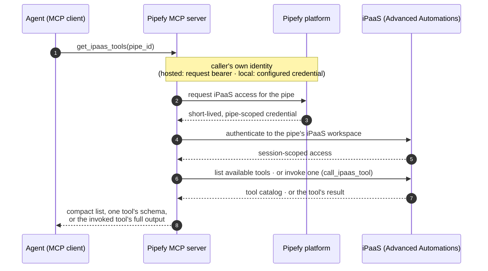

# iPaaS (Advanced Automations)

Discover and invoke the iPaaS tools available to a pipe's workspace, and connect the apps those tools orchestrate.

**`pipe_id`** matches GraphQL: use a **string** (unquoted JSON integers are coerced). See [Pipefy IDs in pipes & cards](pipes-and-cards.md#pipefy-ids-type-safety).

## Vocabulary

**iPaaS (Advanced Automations)** is Pipefy's embedded workflow-automation platform. A flow built on it connects Pipefy with external apps. The organization enables iPaaS, never a single pipe.

**iPaaS workspace.** Every pipe has its own iPaaS workspace, which holds its flows, its connections, and the tools it offers. The same call against two pipes can therefore return different catalogs. A flow can orchestrate across many pipes, but it lives in, and is visible from, exactly one pipe's workspace.

**Connection.** A connection is an app credential stored in a pipe's iPaaS workspace. A flow step that acts on that app references the connection by its `external_id`.

**Meta tool.** A meta tool exposes a catalog of other tools on demand, so an agent loads a large tool surface only when it needs it. `get_ipaas_tools` is the meta tool, and `call_ipaas_tool` invokes what it lists.

## The meta-tool pattern

iPaaS exposes a large catalog (flow building, testing, tables, runs: dozens of
tools, some with very large input schemas). Loading everything into an agent's
context would crowd it out, so the surface has three steps (discover, expand, call):

1. `get_ipaas_tools(pipe_id)` returns a compact catalog: each tool's `name` and the
   first line of its description.
2. `get_ipaas_tools(pipe_id, tool_name="...")` returns one tool's full description
   and `inputSchema`, fetched right before you need it.
3. `call_ipaas_tool(pipe_id, tool_name="...", arguments={...})` invokes the
   tool. Arguments are forwarded verbatim; the iPaaS host validates them
   against its own schema and its error messages are relayed back.

Never expand more than the tool you are about to use. Long-running executions
(flow tests, retries) may still be in flight when the call returns, so inspect
progress with the catalog's run-listing tools instead of re-invoking.

## Flow

Every call is stateless. The server mints the credentials per request and caches nothing, so any server replica can serve any call, invocation included. An invocation gets a longer network budget than discovery, because a called tool can run a real flow.

## Connections

Flow steps that act on an external app need a **connection** (the app credential,
stored in the pipe's iPaaS workspace). Before creating one, list what exists
(the catalog's connection-listing tool) and prefer reuse. When several
candidates serve the same piece, agents should name them and ask the user rather
than pick silently.

Two creation paths:

- **Token / API-key pieces.** One `create_ipaas_connection` call with
  `connection_type` (`SECRET_TEXT`, `BASIC_AUTH`, or `CUSTOM_AUTH`) and `value`
  matching the piece's auth props. A literal secret passed this way transits the
  conversation, including the model vendor's API. Users who don't accept that
  trade-off can store the secret in the MCP server's environment and reference
  it as `{"$env": "PIPEFY_IPAAS_CONNECTION_<NAME>"}` instead: only variables
  under that prefix resolve, and the value never enters the conversation. The
  variable must be set before the server starts (e.g. the `env` block of its
  MCP configuration). `$env` references work on locally-run servers only: a
  hosted (`remote`-profile) server rejects them, because its environment
  belongs to the deployment and would be resolvable by every caller.
- **OAuth pieces.** `get_ipaas_connection_auth_url` returns a consent URL and a
  `completion` bundle; the user opens the URL, authorizes, and pastes back the
  redirect URL they land on; `create_ipaas_connection` finishes with
  `oauth={completion, authorization_response}`. The durable tokens are exchanged
  and stored host-side, so no lasting secret ever enters the conversation. This
  path requires the deployment to have an OAuth client configured for the piece;
  when it doesn't, the tool says so and the token path (or the product UI)
  remains.

Creation is an **upsert on `external_id`**: omitting it creates a fresh
connection; passing an existing connection's `external_id` replaces its
credential in place (rotation). Credentials are validated by the iPaaS host at
creation time, so a bad token fails immediately with the host's own message.

## Requirements

- The caller must be allowed to **create automations on the pipe** (pipe-admin
  ability); the organization must have **iPaaS enabled**.
- Invocation exposes the full catalog, destructive operations included, because the same caller already has that surface in the product's Advanced Automations UI. The MCP path grants nothing beyond it, and `call_ipaas_tool` is annotated destructive so that agent clients apply their approval flows.
- All four tools are marked remote-safe and register on both profiles: every
  call acts with the caller's own identity (the pipe-scoped token is minted
  per request), so a hosted multi-user server needs no extra setup, apart from the
  one `$env` restriction noted above.
- No server configuration is needed against production: the deployment defaults
  to Pipefy's canonical public OAuth client (see
  [`docs/config.md`](../../config.md)). Staging/single-tenant hosts override
  `PIPEFY_IPAAS_URL` + `PIPEFY_IPAAS_OAUTH_CLIENT_ID`; a blank client id
  disables both tools, which then answer with a clear "disabled" error.
