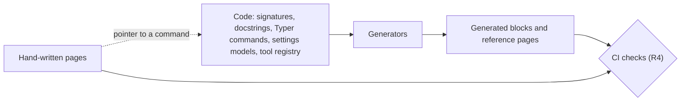

# RFC-0001: A small, predictable documentation set

- Status: Draft
- Created: 2026-10-08
- Evidence base: `dev` as of the merge of PR #757 (commit `e85483bf`). Line numbers and counts in this RFC hold at that commit.
- Neighbors: RFC-0002 (the quality bar for tests) and RFC-0003 (code behavior and architecture)

## Summary and motivation

The toolkit's docs copy facts that the code already owns: the parameters of a tool, the commands of the CLI, the settings that the packages read. People keep those copies by hand, and the copies drift. We have run into this ourselves: more than once, a false statement in the docs steered an implementation before anyone noticed that the code said otherwise.

To write this RFC, we searched the docs and docstrings for such statements. Without a full audit, we found at least 13 that are false or misleading, or that contain links that break where readers see them. The existing doc checks pass on all of them. The clearest one tells the reader to pass `debug=true` to `execute_graphql`, a tool that has no `debug` parameter. It is one of 10 hand-written copies of the `debug=true` convention.

The docs also have a second, separate problem: no rule says where a page belongs. Each author picks the place for a new page, so three pages for contributors sit at the top of the user docs, and a reader cannot predict where a fact lives.

We propose two principles:

1. A fact that the code owns has no hand-written copy. A page tells the reader where the code shows the fact. For example, `pipefy field create --help` lists every field type that the API defines, so no page needs its own copy of that list. When the reader cannot run a command at the moment they need the fact, the fact is generated into the page, and CI fails when the generated text is stale.
2. The path of a page tells the reader who the page is for, which product it covers, and what kind of page it is. The reader is a user or a contributor. The product is the MCP server, the CLI, or the SDK. The kind is one of the four kinds of the [Diataxis](https://diataxis.fr) framework: tutorial, how-to guide, reference, or explanation.

People write the rest by hand: tutorials, how-to guides, explanations, and the reasons behind a design. A machine checks each statement in them that a machine can check, such as a link, a command, or an example.

"Small" follows from the first principle: the docs hold fewer statements, and each fact has one source. "Predictable" follows from the second: an author knows where a new page goes, and a reader knows where to look. R1 turns the first principle into a rule that a reviewer can check, R2 and R3 do the same for the second, and R4 makes a machine check what people write.

If this works, a fact that the code owns stops drifting, because no person keeps a copy of it. A code change touches fewer hand-written pages, because the copies that it would make stale no longer exist. And a reader finds a fact by its path, not by a search.

## Problem statement

### Copies of facts that the code owns

Authors describe one behavior in many places: the docstring, the CLI help, a tool page in `docs/mcp/tools/`, one or more skills, `docs/parity.md`, and sometimes `docs/architecture.md` or a package `AGENTS.md`. Each copy changes on its own schedule.

The copies multiply. The convention that write tools take `debug=true` is written out in 6 pages in `docs/mcp/tools/` and in 4 skills. One of those copies applies it to `execute_graphql`, which has no `debug` parameter. The tool count "187" appears in `docs/parity.md:5`, `docs/parity.md:229`, `packages/mcp/README.md:3`, and `packages/mcp/README.md:100`. A test compares the number at `docs/parity.md:5` with the registry (`tests/test_parity.py:131`), and no test reads the other three.

`docs/parity.md` holds 187 rows, one per MCP tool, and 182 of them name a CLI command. Each of 17 skills has its own `references/cli.md` file, and 13 of these files hold 162 more rows. Each of these 344 tool-to-command pairs is a copy of a fact that the code owns. In 161 of the 187 rows of `docs/parity.md`, a note follows the pair. Only 5 of these notes give the reason that a tool has no CLI command. About 150 repeat a fact that the code already holds, such as the options of a command.

The pages in `docs/mcp/tools/` follow the same pattern: they copy tool counts, parameter lists, and CLI commands from the code. We count around 200 such lines across the 16 pages.

The commit history shows how often a code change also needs a doc edit. Of the 10 Markdown files with the most commits on `dev` that are not merges, 2 are `CHANGELOG.md` and `RELEASE.md`, which change with the code by design. For 5 of the other 8, more than half of the commits also change `.py` files, and 3 of those 8 are skills. A commit that changes both does not prove that the doc repeats the code, but it shows that doc edits follow code changes closely.

### Wrong statements and broken links

Copies that change on their own schedule end up wrong. These statements are false, outdated, or break where readers see them:

| Where | What the text says | What the code or the tree shows |
|---|---|---|
| `skills/pipes-and-cards/pipefy-pipes-and-cards/references/cli.md:19` | `get_pipe` runs as `pipefy phase get <id>` | `pipefy phase get` calls `get_phase_fields` (`packages/cli/src/pipefy_cli/commands/phase.py:46`), as `docs/parity.md:144` also says |
| `skills/pipes-and-cards/pipefy-pipes-and-cards/references/cli.md:84` | `get_pipe` runs as `pipefy label list --pipe <id>` | The command calls the SDK method `get_pipe`, but the MCP tool for it is `get_labels`. The "Operation" column mixes MCP tool names and SDK method names, so the row reads as a wrong mapping |
| `skills/introspection/pipefy-introspection/references/mcp.md:44` | Pass `debug=true` to `execute_graphql`, and check `path` | `execute_graphql` has no `debug` parameter, and its error branch keeps only the `message` of each error, so neither `path` nor `correlation_id` reaches the caller |
| `README.md:198`, and the layout block at `AGENTS.md:21-26` | The workspace has three Python packages | `pyproject.toml:13` lists five: `sdk`, `mcp`, `cli`, `auth`, and `infra` |
| `docs/config.md:122` | "A future file-backed keyring backend will write its credential store as `~/.config/pipefy/keyring.cfg`" | The backend exists: `configure_keychain_backend("file")` writes `keyring.cfg` through `_KEYRING_FILENAME` (`packages/auth/src/pipefy_auth/storage.py:34`) |
| `packages/cli/README.md:85` | See `CLAUDE.md` for contributor guidance | The root has no `CLAUDE.md`. The only tracked one is the symlink `packages/mcp/CLAUDE.md` |
| `README.md:341` | "Each published blueprint ships with a `COMPLIANCE.md`" | No skill ships a `COMPLIANCE.md`. The only tracked one is the template, `docs/compliance/COMPLIANCE.template.md`. `packages/sdk/hatch_build.py` packs only `SKILL.md` and `references/`, so a `COMPLIANCE.md` would not reach the wheel. No code or skill uses the term "blueprint" |
| `packages/mcp/README.md`, `packages/cli/README.md`, `packages/sdk/README.md` | 12 relative links of the form `../../docs/...`, on 8 lines | Each `pyproject.toml` sets `readme = "README.md"`, so these READMEs become PyPI pages, where relative links break |
| `docs/mcp/tools/portal.md:110` | `create_portal_page` takes `interface_uuid` and an optional `elements` | The signature takes `portal_uuid`, `title`, `description`, and `index` (`packages/mcp/src/pipefy_mcp/tools/portal_tools.py:282-287`) |
| `docs/mcp/tools/ipaas.md:81-82` | A blank client id "disables both tools" | The server has four iPaaS tools, and each one returns the "not configured" error when the gateway is missing (`packages/mcp/src/pipefy_mcp/tools/ipaas_tools.py:168-170`) |

Three more statements describe behavior that the code does not have:

- `docs/mcp/tools/cross-cutting.md:21` says that keys in `extra_input` that repeat a parameter are ignored. The 19 tools with `extra_input` handle such a key in several different ways, and some raise `TypeError`.
- `docs/mcp/tools/cross-cutting.md:11` says that empty, zero, and invalid IDs fail before any network call. `PipefyId` accepts `0`, `-1`, and `"abc"`, and about a third of the 122 tools with `PipefyId` parameters never call `validate_tool_id`.
- The docstrings at `packages/mcp/src/pipefy_mcp/tools/automation_tools.py:518` and `packages/sdk/src/pipefy_sdk/client.py:1073` say that an `active` key in `extra_input` wins. `packages/sdk/src/pipefy_sdk/client.py:1097-1098` passes `active=active` and then `**(extra_input or {})`, which raises `TypeError`.

RFC-0003 owns this behavior, so we correct these three statements only after RFC-0003 settles it.

Each of these statements passes the existing checks. `lint_skill_refs.py` checks that an operation name exists, and that a `pipefy` command path and its options exist. It checks each cell on its own, so a row that pairs a real tool with the real command of another tool passes. `tests/test_parity.py` checks that every tool has a row and that the command path exists, but not that the command implements the tool. CI and the pre-commit hooks run no link checker and no Markdown linter. Only two checks read prose: `tests/test_parity.py` reads the tool count at `docs/parity.md:5`, and `tests/test_uninstall_scan.py` reads the `PIPEFY_*` table in `docs/config.md`.

Docs also drift when no code changes. The first two rows were correct until PR #715. That PR changed skills, tests, and the skill lint, but no code under `packages/`. Its commit "docs: Separate skill surface instructions" split the skill tables per product and dropped the note column that explained them.

### Page placement

The 32 pages in `docs/` mix kinds of content at every level:

- `architecture.md`, `response-typing.md`, and `dependencies.md` are pages for contributors, but they sit at the top of the user docs.
- `DEPRECATION.md` is a policy page, and `docs/README.md` does not link it.
- `docs/mcp/tools/` holds 16 pages: 14 domain pages that are part reference and part explanation, plus `cross-cutting.md` and `identifiers.md`.
- `docs/cli/auth.md` mixes a quick start, a reference section, a troubleshooting section, and an explanation section in 292 lines.
- `docs/` has no tutorial for any product. The only quick starts for a product are sections inside `docs/cli/auth.md` and `packages/cli/README.md`.

The repository root holds 8 Markdown files. Six of them follow a convention that readers expect at the root. `RELEASE.md` and `TERMS.md` follow none, so a reader cannot predict that they exist. Because no rule exists, each author picks the place for a new page, and each new page adds to the mix.

### The cheaper alternative

The cheapest response is to fix the 13 statements found so far, add a link checker, and extend the skill lint so that it checks each tool-to-command pair. We include the first two, but we do not think that they stop the next drift.

A fixed copy is still a copy, and nothing ties it to the code. `README.md:198` has said "three Python packages" since 2026-05-18. The `pipefy-auth` package arrived four days later, in PR #216. After that, 55 commits that are not merges changed `README.md`, and none of them corrected the sentence.

A link checker would not have caught that sentence either, because nothing in it is a broken link. The keyring row has the same problem.

Checking each pair runs into a deeper problem: the check needs a correct pair to compare against. No code records which CLI command implements which MCP tool, so the only record is the hand-kept tables that the check would test. Once the code records the mapping, the tables only repeat it, so we can generate or delete them, which costs less than checking them.

### Consequences

- **Agents act on false instructions.** Authors write skills for agents. An agent that follows the first three rows of the table in "Wrong statements and broken links" calls the wrong command, or passes a parameter that does not exist.
- **A code change carries doc edits in several files.** A change to one tool can touch its docstring, a tool page, a skill, and `docs/parity.md`. Each extra file is one more place to forget, and one more diff to review.

## Explicit non-goals

This RFC decides where a fact is written, how it reaches readers and agents, where each page belongs, and what the doc checks verify. It leaves these items to others:

| Item | Decided by |
|---|---|
| Code behavior, such as the `extra_input` precedence and the ID checks above, the promises in docstrings and `--help` texts, and the content of the architecture docs | RFC-0003. This RFC decides only where these texts live and how they reach readers |
| How the doc checks are tested, and the quality bar that every test meets | RFC-0002. This RFC decides only what the doc checks verify |
| The legal text of `TERMS.md` | The owner of the legal text. This RFC proposes only where the file lives |

This RFC does not propose a docs site with its own user interface, and the layout that it proposes keeps that option open.

## Proposed solution

### Rules

#### R1: One source of truth per fact

Every fact has one source of truth: the one place where it is written. For the parameters of an MCP tool, the commands and options of the CLI, the settings that the packages read, and the flags of `install.sh` and `uninstall.sh`, that place is the code. Every other fact has a person as its source.

Every other place reaches a fact that the code owns in one of two ways:

1. A pointer: a sentence that tells the reader where the code shows the fact, such as "Run `sh install.sh --help` for the flags." This is the default, because a pointer holds no copy of the fact, so it stays correct when the fact changes.
2. A generated block, when the reader cannot run a command at the moment they need the fact. Two cases exist today:
   - a page that readers see outside the repository, such as a package README on PyPI
   - an agent that chooses a tool before it calls one

A generator writes each generated block between two markers. CI runs the generator again and fails when the committed text differs from its output. The tool for this is `cog`, and its `--check` flag is the check in CI.

A count of things that the code defines, such as tools, commands, packages, or skills, is also a fact that the code owns. A sentence rarely needs the number, so the first choice is to delete it. For example, `packages/mcp/README.md:3` says "MCP server for Pipefy — **187 tools** for AI agents", and the sentence works as "MCP server for Pipefy, with tools for AI agents". A recent commit already deleted a count in this way: `476ada8d` changed "an `enum` of the 24 values" in `CHANGELOG.md` to "an `enum` of the values". When a reader needs the number, a generator writes it.

Every copy in "Copies of facts that the code owns" disappears under this rule: the first four rows of the table in "Wrong statements and broken links", the `debug=true` convention in 10 places, the tool count in 4 places, the 162 tool-to-command pairs in the skills, and the copies in `docs/mcp/tools/`. Fixing them by hand would not last, as the 55 commits in "The cheaper alternative" show.

The 182 pairs in `docs/parity.md` go too. The page keeps only what neither product shows on its own: the 5 tools that have no CLI command, each with its reason, and the behavior that differs between the MCP server and the CLI. For example, MCP asks for a `confirmation_token` where the CLI asks for `--yes`. To find the command for a tool, the page points to the CLI reference.

No code records today which CLI command implements which MCP tool, or why a tool has none. The 187 rows of `docs/parity.md` are the only record. `tests/test_parity.py` reads them to make sure that every new tool has either a CLI command or a stated reason. We ask RFC-0003 to move that record into the tool registry, so the check reads code instead of a doc. The same record lets the help of each command name the MCP tool that it implements, such as "MCP tool: `get_cards`" in `pipefy card list --help`. We do not wait for that record: `docs/parity.md` shrinks during the migration (see "Drawbacks").

#### R2: The path of a page declares its place

A layout table maps each path pattern to the place of a file. Every tracked Markdown file matches one pattern, and CI fails on a file that matches none. A new pattern needs a reviewed edit to the table.

Under `docs/`, a path has three parts: `docs/<section>/<kind>/<subject>.md`.

- The section is one of `docs/` (global), `docs/contributing/`, `docs/mcp/`, `docs/cli/`, and `docs/sdk/`. R3 decides the section of each fact.
- The kind is one of the folders `tutorial/`, `how-to/`, `reference/`, and `explanation/`. The file `README.md` in each section is its landing page.
- The subject names what the page covers, such as `login.md` or `identifiers.md`.

Every section uses the same kind folders, so a reader who knows one section can find a page in any other. A folder exists only when it holds a page.

Each page starts with front matter that holds two fields: `title` and `description`. The landing page of a section lists its pages with these fields. The front matter does not repeat the kind, because the path already holds it (R1).

Outside `docs/`, the layout table names every other place. The repository root holds six Markdown files, each of which follows a convention that readers expect: `README.md`, `CONTRIBUTING.md`, `SECURITY.md`, `CODE_OF_CONDUCT.md`, `AGENTS.md`, and `CHANGELOG.md`. `RELEASE.md` and `TERMS.md` move into `docs/`. The table also names the package READMEs, the skills, and `rfcs/`.

A package README becomes a page on PyPI, so it links only to section landing pages, with absolute GitHub URLs.

Today's tree shows why the path has to carry this: three contributor pages sit at the top of the user docs, and two root files follow no convention ("Page placement"). The PyPI rule comes from the 23 relative links in the package READMEs that break on pypi.org, 12 of them into `docs/`.

#### R3: The section of a fact

This rule works on facts, because one page today often mixes facts for different readers, as `docs/cli/auth.md` does. It starts with one question: what is the reader working with when they need the fact?

1. If the reader is changing the repository, the fact belongs to the contributor section, `docs/contributing/`.
2. Otherwise, the reader uses a product: the MCP server, the CLI, or the SDK. A fact that holds for one product belongs to the section of that product.
3. A fact that holds for two or more products belongs to the global section, `docs/`.

The location of the code does not decide. For example, `pipefy_auth/flow.py` raises `State mismatch on OAuth callback`, but only `pipefy auth login` runs that flow, so the fix for that error belongs to the CLI section.

The contributor section shares no fact with the user sections. Its pages can link to user pages, but no page includes text from the other side.

A global page can include text from a product page, but a product page never includes text from a global page. Each product section is complete on its own. A global page adds only the ideas that span products, and a product page links to global pages for them. As a result, two sections never hold the same fact.

We use "global" for a fact that holds for two or more products, and we avoid "cross-cutting", because today that word names `docs/mcp/tools/cross-cutting.md`, a page about one product.

We expect this rule to settle most placement questions in review, because today each author picks the place for a new page ("Page placement").

#### R4: A machine checks every claim that it can check

Each check and each generator uses a maintained open-source tool when one exists. The repository writes its own code only for inputs that no tool reads: the layout table, the tool registry, the settings models, and the front matter of the pages. A standard tool has its own documentation and its own maintainers, so the repository keeps only its config.

CI runs these checks at every commit on `dev`:

- The layout table check (R2). No tool knows the layout table, so this check is a short script in `.github/workflows/scripts/`, beside `lint_skill_refs.py`.
- The freshness check for generated blocks (R1), with `cog --check`.
- A link checker over all Markdown files, with `lychee`.
- A Markdown linter, with `markdownlint-cli2` and a committed config.
- Executable examples, with Sybil, a pytest plugin: each `pipefy` command block and code snippet in a hand-written page runs as an offline test, and each MCP call example is checked against the input schema of its tool. In the prototype, the `debug=true` advice, written as an example, fails with `execute_graphql has no parameter debug`.

`pre-commit` runs the same checks on a contributor's machine. The repository already uses it for `ruff` and `shellcheck`.

Each claim about behavior in a hand-written page is tested in one of three ways: by an executable example, by a pointer or a generated block (R1), or by a link to a named test. A reviewer deletes a claim that none of these tests.

None of this runs today. CI has no link checker and no Markdown linter, and the existing checks pass on all 13 statements that we found. RFC-0002 sets the quality bar for these checks as tests.

#### How confident we are

We are most confident about R1 and R4. The 55 commits that never corrected "three Python packages" show that a copy kept by hand drifts, and R4 only adds standard tools. R2 and R3 are a bet. Diataxis names four kinds of documentation but does not prescribe folders, and the layout below is our best reading of it for a toolkit with three products. A prototype in draft [PR #776](https://github.com/pipefy/ai-toolkit/pull/776) tests that bet before the migration starts. It moves `identifiers.md` to the global section and generates the global landing list from front matter. Reviewers browse the result on GitHub, and their feedback decides whether the layout holds. The prototype also found that no naming rule for IDs holds across products (see the `identifiers.md` paragraph in the Layout). If readers still search more than they browse, we will change the layout and keep the principles.

### Layout

#### How a fact reaches a page



The code is the source of truth for every fact that it can state. Generators read the code and write the reference pages and the generated blocks. People write everything else, and a hand-written page reaches a fact of the code through a pointer or a generated block (R1). Every page passes the same checks before it reaches `dev`.

`cog` runs every generator that writes a block inside a page. A generator that writes a whole page also runs in CI, and CI fails when the page changes. The generators cover these outputs:

- The MCP tool reference, from the tool signatures and docstrings, one page per group of tools. No tool reads the tool registry, so this generator is a script in `.github/workflows/scripts/`.
- The CLI command reference, from the Typer app, with `typer pipefy_cli.main utils docs`. Once the registry records the mapping (R1), each command in it names the MCP tool that it implements.
- The SDK reference, from the docstrings of the public API.
- The settings table in `docs/reference/config.md`, from the settings models.
- The counts that a reader needs, from the tool registry. The other copies of a count are deleted.
- The list in `docs/reference/parity.md` of the tools that have no CLI command, with the reason for each, and the tool-to-command table in each skill's `references/cli.md`, once the registry records the mapping (R1).
- The landing page of each section, from the `title` and `description` of its pages.
- The documentation map in `AGENTS.md`.

#### The tree under `docs/`

```
docs/
  README.md                          landing page (generated)
  tutorial/getting-started.md        install, sign in, first task through a skill
  how-to/install.md                  includes each product's install steps
  how-to/login.md                    service account and static token
  how-to/uninstall.md
  reference/auth-errors.md
  reference/config.md                generated block
  reference/glossary.md
  reference/parity.md                tools with no CLI command, behavior differences
  reference/terms.md
  explanation/authentication.md      credential order, stored session, keychain
  explanation/identifiers.md
  explanation/versioning.md          lockstep versions and deprecation
  contributing/
    README.md
    tutorial/getting-started.md      local setup and a first change
    how-to/add-capability.md
    how-to/release.md
    how-to/run-checks.md
    reference/authoring.md           rules for docs and skills
    reference/code-rules.md
    reference/glossary.md
    explanation/architecture.md
    explanation/dependencies.md
    explanation/ipaas-internals.md
    explanation/response-typing.md
    explanation/rfc-process.md
  mcp/
    README.md
    tutorial/getting-started.md
    how-to/install.md
    how-to/login.md                  OAuth sign-in in the MCP client
    how-to/self-host.md
    how-to/upgrade.md
    reference/<group>.md             generated from the tools
    explanation/confirmations.md
    explanation/deployment.md
    explanation/ipaas.md
    explanation/tool-conventions.md
  cli/
    README.md
    tutorial/getting-started.md
    how-to/install.md
    how-to/login.md                  pipefy auth login, headless and SSH
    how-to/self-healing.md
    reference/commands.md            generated from the Typer app
    explanation/login.md             the login flow and eager refresh
  sdk/
    README.md
    tutorial/getting-started.md
    how-to/install.md
    how-to/upgrade.md
    reference/api.md                 generated from the docstrings
```

The global section holds 12 pages besides its landing page, because only a few ideas hold for two or more products: credentials and the stored session, shared configuration, installers that set up several products, lockstep versions, parity, Pipefy concepts such as the forms of an ID, and the legal terms.

The stored session is global because two products use it. The CLI writes it with `pipefy auth login`, and the local MCP server reads it at startup (`StartupIdentity.from_configured_credential` in `packages/mcp/src/pipefy_mcp/auth/session_identity.py:42`).

The global tutorial follows the agent path: install the plugin or run `install.sh`, sign in, and ask the agent for a first task. That path spans products by nature, because every skill needs the MCP server or the CLI. Each product section has its own tutorial for a reader who uses only that product.

Skills have no section. A skill cannot be complete on its own, so its install steps are part of the global `how-to/install.md`, and its catalog stays in `skills/README.md`.

#### Where today's mixed pages go

Four pages and the 14 domain pages in `docs/mcp/tools/` mix kinds or products today. Each one splits by R2 and R3:

| Page today | New places |
|---|---|
| `docs/cli/auth.md` (292 lines) | The quick start and "Headless / SSH" go to `docs/cli/how-to/login.md`. The flags and exit codes come from the generated CLI reference. The credential order and the keychain backends go to `docs/explanation/authentication.md`. Errors that any product can raise go to `docs/reference/auth-errors.md`, and errors that only `pipefy auth login` raises stay in the CLI section. |
| `docs/mcp/tools/cross-cutting.md` | Pagination, `extra_input`, `debug`, and error payloads go to the tool docstrings, and from there to the generated MCP reference. The reasons behind confirmations go to `docs/mcp/explanation/confirmations.md`. The conventions that every tool follows go to `docs/mcp/explanation/tool-conventions.md`. The ID facts go to `docs/explanation/identifiers.md`. |
| The 14 domain pages in `docs/mcp/tools/` | The copies of the code leave, because the docstrings and the generated MCP reference hold them. The rest splits by kind and reader: the steps go to `docs/mcp/how-to/`, the explanations go to `docs/mcp/explanation/`, and the notes for maintainers go to `docs/contributing/`. |
| `docs/MIGRATION.md` | The cutover note goes to `CHANGELOG.md`. The MCP steps go to `docs/mcp/how-to/upgrade.md`, the settings model steps go to `docs/sdk/how-to/upgrade.md`, and the service-account rename goes to `docs/how-to/login.md`. |
| `docs/ipaas.md` | The flow and the credential minting go to `docs/contributing/explanation/ipaas-internals.md`. The settings come from the generated `docs/reference/config.md`. The vocabulary goes to `docs/mcp/explanation/ipaas.md`. |

`docs/mcp/tools/identifiers.md` becomes the global `docs/explanation/identifiers.md`, because the CLI and the SDK take the same four forms of an ID. The per-tool argument rows leave. The docstrings state each of the 12 exceptions that we checked, such as "Numeric ID of the source pipe" for `source_repo_id`.

Today no naming rule holds across products. On MCP, one pipe has five argument names: `pipe_id`, `repo_id`, `source_repo_id`, `repo_uuid`, and `pipe_uuid`. On the CLI, `--repo` is a pipe UUID in `pipefy agent list` and a numeric pipe or table id in `pipefy email template list`. We ask RFC-0003 to standardize these names, so that the name of an argument or option tells its form in every product. The global page then states that one rule, and the exceptions leave the docstrings too.

#### Files outside `docs/`

- **The root.** `README.md` introduces the toolkit, keeps one tested install snippet, and links to the landing page of each section. `CONTRIBUTING.md` holds the commit, sign-off, and pull request rules, and it links to `docs/contributing/README.md`. `CHANGELOG.md` holds the history. `RELEASE.md` becomes `docs/contributing/how-to/release.md`, `DEPRECATION.md` joins `docs/explanation/versioning.md`, and `TERMS.md` becomes `docs/reference/terms.md` once the owner of the legal text agrees.
- **Agent instructions.** `AGENTS.md` is the only instruction file, at the root, in `packages/mcp/`, and in `skills/`. Claude Code reads `AGENTS.md` when no `CLAUDE.md` exists, so the symlink `packages/mcp/CLAUDE.md` goes away. Each rule line in an `AGENTS.md` links to its page in `docs/contributing/reference/`.
- **Package READMEs.** Each one is a short PyPI page with the install command and absolute links to its section's landing page (R2).
- **Starter files.** The skill starter in `.github/skill-template/` and `docs/compliance/COMPLIANCE.template.md` move to the root folder `template/`, because a contributor copies them and nobody reads them as pages.
- **RFCs.** They stay in `rfcs/`, outside `docs/`. A draft asks for a decision and an accepted RFC records one, so an RFC fits no Diataxis kind.

#### One fact before and after

Today, 6 pages in `docs/mcp/tools/` and 4 skills describe the `debug=true` convention by hand. One of them, `skills/introspection/pipefy-introspection/references/mcp.md:44`, tells the reader to pass `debug=true` to `execute_graphql`. The signature of `execute_graphql` (`packages/mcp/src/pipefy_mcp/tools/introspection_tools.py:177`) has no `debug` parameter, and no check notices.

Once these rules hold, the parameter list of `execute_graphql` exists in one place: its signature. The generated MCP reference shows it, and an agent reads the same list in the tool schema. A skill that needs the list points to the tool schema. A hand-written example that calls the tool with `debug=true` runs as an executable example, and the run fails because the parameter does not exist.

#### Work that the neighbors supply

- **RFC-0003** adds the tool-to-command mapping to the tool registry, keeps `Args:` sections in the docstrings that the generators read, and writes the content of the architecture pages. We ask RFC-0003 to accept that the arc42 sections of the architecture live by kind: the goals and the runtime view in `docs/contributing/explanation/architecture.md`, the deployment view in `docs/mcp/explanation/deployment.md`, the rules in `docs/contributing/reference/code-rules.md`, and the decisions in `rfcs/`.
- **RFC-0002** sets the quality bar for the checks in R4, as tests.

## Drawbacks and alternatives

### Drawbacks

- **New tools.** `cog` and Sybil come from PyPI. `lychee` is a Rust binary: its pre-commit hook downloads it on the first run, which needs `bash` and network access. `markdownlint-cli2` runs on Node, which pre-commit installs on its own. Each tool adds a config file and a version to keep current.
- **Code of our own.** The layout table check and the MCP reference generator are scripts that the repository maintains. A change to the tool registry or to the docstring format can need a change to the generator.
- **Moved pages.** Most pages move, so links from outside the repository break: bookmarks, other repositories, and the READMEs of versions already on PyPI. A redirect stub at each old path catches a link to the page, but a link to a section of the page lands at the top of the stub. The migration plan covers the stubs.
- **Deeper paths.** Each page sits in a kind folder, so a reader who browses on GitHub clicks once more, even in a section with one tutorial.
- **Front matter on GitHub.** GitHub shows the front matter of a page as a small table above the text.
- **A gap in the parity check.** After `docs/parity.md` shrinks, no check makes sure that a new MCP tool has a CLI command or a stated reason, until the tool registry records the mapping. We accept this risk, because today the 182 pairs mostly repeat the CLI reference.
- **Claude Code versions.** Claude Code reads `AGENTS.md` from v2.1.277, and from v2.1.281 in Bedrock sessions and sessions with telemetry turned off. A personal `CLAUDE.local.md` stops `AGENTS.md` from loading unless the **Project instructions** setting is `claude-md-and-agents-md`. The contributor reference states both conditions.
- **Repetition inside a page.** No check finds a fact that a hand-written page states twice. The split by kind removes part of this repetition, and review must catch the rest.

### Alternatives

- **The cheaper alternative.** Fix the statements, add a link checker, and check each pair. "The cheaper alternative" explains why it does not stop the next drift.
- **Stronger review.** Review already passed the 13 statements in the problem statement. A reviewer cannot compare every copy with the code at every change.
- **Docs beside each package**, as Airflow and google-cloud-python do. This fits packages that release on their own schedule. The toolkit releases its five distributions together, on one version (`RELEASE.md:3`), and the facts that hold for several products would have no home.
- **Kind folders at the top**, such as `docs/how-to/mcp/login.md`, as uv, turborepo, and hatch do. Those repositories document one product. Here, the pages of one product would spread across four folders.
- **The kind in front matter.** With the kind only in front matter, the GitHub file tree hides it. With the kind in both the folder and front matter, one fact has two sources (R1).
- **A single page per kind**, such as `docs/cli/how-to.md`. The page has to move when a second page of its kind arrives.
- **A skills section for the agent tutorial.** A skill needs the MCP server or the CLI, so the lesson would copy their install and login steps.
- **A contributor folder in each product**, such as `docs/mcp/contributing/`. Most contributor work spans products, and each user section would hold pages for two readers again.
- **A root `ARCHITECTURE.md`.** It adds a seventh root file that follows no convention, and it mixes explanation with rules. Agents load only `AGENTS.md`, so it gives them nothing.
- **The full parity table.** Its 182 tool-to-command pairs are copies of a fact that the code will own (R1).

### Prior art

Two projects already generate docs from code and fail CI on a stale page. github-mcp-server runs `generate-docs` and then `git diff --exit-code README.md` in `docs-check.yml`. The Terraform provider scaffolding generates the provider docs with tfplugindocs in `test.yml` and fails on any diff. R1 applies the same check to blocks inside a page, with `cog --check`.

Diataxis names the four kinds but no folder layout, and it advises against empty structures, so a kind folder in this RFC exists only when it holds a page.

We surveyed the docs of 17 open-source monorepos. Eleven keep one central `docs/` folder, three keep docs beside each package, two mix both, and one keeps its docs in another repository. Airflow is the only one that writes down why it chose its layout. In the repositories that split by kind, the split happens once, at the top of one site. This layout repeats it in each section, which is part of the bet in "How confident we are".

## Unresolved questions

1. **The SDK reference generator.** pdoc writes only HTML. mkdocstrings needs MkDocs. Sphinx writes Markdown through `sphinx-markdown-builder`, but needs a Sphinx project. pydoc-markdown has had no release since 2023, and lazydocs none since 2021. Which one do we adopt, or do we write our own script?
2. **The split of the MCP reference.** One page per toolset domain in `tools/toolsets.py`, or one page per tool module (21 today)?
3. **Long landing lists.** When a kind holds many pages, such as the MCP reference, how does the landing page group them?
4. **Repeated code blocks.** Eight fenced code blocks appear in more than one hand-written file today, such as `uvx pipefy-mcp-server` in `docs/MIGRATION.md` and `packages/mcp/README.md`. Should CI fail on a repeated block?
5. **`TERMS.md`.** Who owns the legal text? We have three questions for that owner: may the file move to `docs/reference/terms.md`; should the text live on pipefy.com instead, with a link from the README; and may sections 2, 7, and 8, which repeat `LICENSE`, `SECURITY.md`, and `CONTRIBUTING.md`, become links?
6. **Architecture by kind.** Does RFC-0003 accept that the arc42 sections live by kind, as "Work that the neighbors supply" proposes?

## Migration plan

Pending (pass 5).
